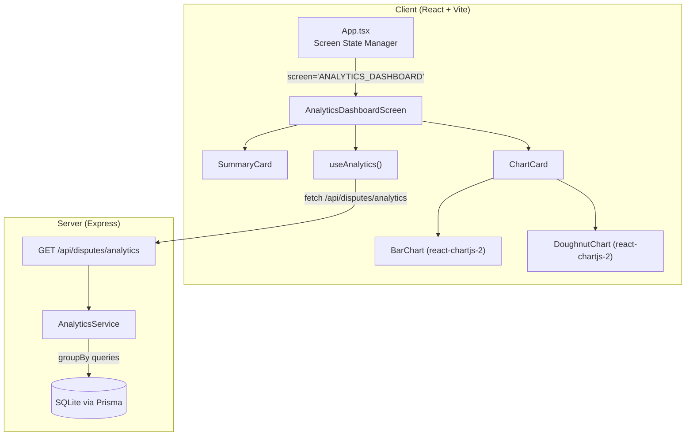
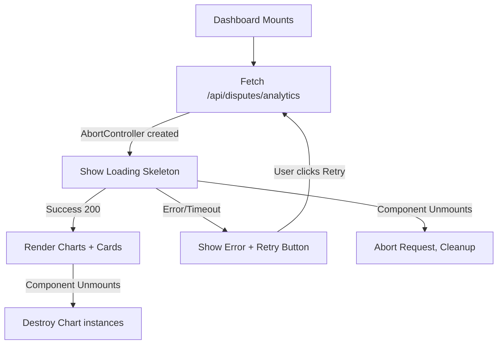

# Design Document: Dispute Analytics Dashboard

## Overview

This feature adds a dedicated Analytics Dashboard screen to the Payment Dispute Triage System. The dashboard presents dispute data as animated charts and summary metric cards, enabling operations staff to identify trends and distribution patterns across Payment Type, Issue Category, Status, and Priority dimensions.

The implementation spans both client and server:

- **Server**: A new `GET /api/disputes/analytics` endpoint that aggregates dispute data from the SQLite database via Prisma `groupBy` queries. Returns structured counts by dimension plus a summary object — all computed fresh on each request (no caching).
- **Client**: A new `AnalyticsDashboardScreen` component renders 4 chart cards (bar and doughnut charts using Chart.js via `react-chartjs-2`) and 4 summary metric cards. Charts animate on mount using Chart.js built-in animation, respecting `prefers-reduced-motion`. The screen integrates into the existing state-based navigation in `App.tsx`.

The dashboard is read-only and adds no new database models — it queries the existing `Dispute` table using aggregate functions.

## Architecture



### Key Architectural Decisions

1. **Dedicated analytics endpoint** — Rather than computing aggregations on the client from the paginated disputes list, a purpose-built `/api/disputes/analytics` endpoint performs all aggregation server-side via Prisma `groupBy`. This keeps the client simple and avoids fetching all dispute records.

2. **No caching** — The endpoint computes fresh results on every request (Requirement 1.9). Given the SQLite dataset size for this prototype, aggregate queries are fast enough without caching.

3. **Chart.js via react-chartjs-2** — The project already has no charting library installed, but Chart.js is the standard choice for React projects needing animated, accessible charts without heavy bundle size. `react-chartjs-2` provides idiomatic React wrappers with props-driven updates and built-in animation support.

4. **State-based navigation** — Follows the existing pattern: a new `'ANALYTICS_DASHBOARD'` value is added to the `Screen` union type. The existing "Dashboard" nav item (already rendered but inactive) is wired up to set this screen state.

5. **Responsive layout** — Charts use a 2-column CSS grid on `md` (768px+) and single-column below. Summary cards use a 4-column row on `md` and 2×2 grid on mobile. This aligns with the existing responsive patterns.

6. **Animation with accessibility** — Chart.js respects `prefers-reduced-motion` via its `animation` configuration. When reduced motion is preferred, animations are disabled (duration set to 0), rendering charts at final values immediately.

## Components and Interfaces

### Server Components

#### Analytics Route (`server/src/routes/analytics.ts`)

A new Router mounted at `/api/disputes/analytics` in the server entry point.

```typescript
import { Router, Request, Response, NextFunction } from 'express';
import { getAnalytics } from '../services/analyticsService.js';
import { AppError } from '../middleware/errorHandler.js';

export const analyticsRouter = Router();

/**
 * GET / — Aggregate dispute analytics
 * Requirements: 1.1–1.9
 */
analyticsRouter.get('/', async (_req: Request, res: Response, next: NextFunction) => {
  try {
    const analytics = await getAnalytics();
    res.json(analytics);
  } catch (error) {
    const appError: AppError = new Error('Failed to retrieve analytics data') as AppError;
    appError.status = 500;
    appError.code = 'ANALYTICS_QUERY_FAILED';
    next(appError);
  }
});
```

#### Analytics Service (`server/src/services/analyticsService.ts`)

Encapsulates the aggregation logic. Performs multiple Prisma `groupBy` queries and assembles the response.

```typescript
export interface AnalyticsBreakdown {
  label: string;
  count: number;
}

export interface AnalyticsSummary {
  totalDisputes: number;
  openDisputes: number;
  resolvedDisputes: number;
  highPriorityDisputes: number;
}

export interface AnalyticsResponse {
  paymentType: AnalyticsBreakdown[];
  issueCategory: AnalyticsBreakdown[];
  status: AnalyticsBreakdown[];
  priority: AnalyticsBreakdown[];
  summary: AnalyticsSummary;
}

export async function getAnalytics(): Promise<AnalyticsResponse>;
```

**Implementation details:**
- `paymentType`: `groupBy` on `paymentType`, then map CARD→"Card", EFT→"EFT", INTERNAL→"Internal Transfer". Always includes all 3 labels, defaulting to 0.
- `issueCategory`: `groupBy` on `issueCategory`, then format label as title case with underscores replaced by spaces (e.g., `DUPLICATE_DEBIT` → "Duplicate Debit"). Only categories with count > 0 are included.
- `status`: `groupBy` on `status`, map OPEN→"Open", TRIAGED→"Triaged", CLOSED→"Closed". Always includes all 3 labels.
- `priority`: `groupBy` on `priority`, map HIGH→"High", MEDIUM→"Medium", LOW→"Low". Always includes all 3 labels.
- `summary`: `count()` for total, `count({ where: { status: 'OPEN' } })` for open, `count({ where: { status: 'CLOSED' } })` for resolved, `count({ where: { priority: 'HIGH' } })` for high priority.

### Client Components

#### AnalyticsDashboardScreen (`client/src/components/AnalyticsDashboardScreen.tsx`)

Top-level screen component. Fetches data via `useAnalytics` hook, renders loading/error/data states.

```typescript
// No props needed — the dashboard displays global analytics
export function AnalyticsDashboardScreen(): JSX.Element;
```

**Responsibilities:**
- Calls `useAnalytics()` hook on mount
- Displays loading skeleton while fetching
- Displays error message with retry button on failure
- Renders 4 SummaryCard components in a row
- Renders 4 ChartCard components in a 2-column grid
- Cleans up (AbortController) on unmount

#### SummaryCard (`client/src/components/SummaryCard.tsx`)

A compact metric card with label, value, and optional icon.

```typescript
interface SummaryCardProps {
  label: string;          // e.g., "Total Disputes"
  value: number;          // Raw numeric value
  icon: string;           // Material symbol name
  variant?: 'default' | 'warning' | 'success' | 'danger';
}

export function SummaryCard({ label, value, icon, variant }: SummaryCardProps): JSX.Element;
```

**Display logic:**
- Formats value with `Intl.NumberFormat` for thousands separators (e.g., 1234 → "1,234")
- Displays "0" for zero values (never hides)
- Uses `aria-label` associating metric name with value for screen readers

#### ChartCard (`client/src/components/ChartCard.tsx`)

A wrapper providing the card container, title, and chart slot.

```typescript
interface ChartCardProps {
  title: string;          // e.g., "Disputes by Payment Type"
  children: React.ReactNode;
}

export function ChartCard({ title, children }: ChartCardProps): JSX.Element;
```

**Styling:**
- White background, 8px border-radius, 1px solid `outline-variant` border
- Title uses `body-lg` token (16px, 400 weight)
- 16px gap between chart cards

#### PaymentTypeChart / IssueCategoryChart (`client/src/components/analytics/BarChartWidget.tsx`)

Renders a Chart.js Bar chart from breakdown data.

```typescript
interface BarChartWidgetProps {
  data: AnalyticsBreakdown[];
  colors?: string[];
  reducedMotion?: boolean;
}

export function BarChartWidget({ data, colors, reducedMotion }: BarChartWidgetProps): JSX.Element;
```

#### StatusChart / PriorityChart (`client/src/components/analytics/DoughnutChartWidget.tsx`)

Renders a Chart.js Doughnut chart from breakdown data.

```typescript
interface DoughnutChartWidgetProps {
  data: AnalyticsBreakdown[];
  colors?: string[];
  reducedMotion?: boolean;
}

export function DoughnutChartWidget({ data, colors, reducedMotion }: DoughnutChartWidgetProps): JSX.Element;
```

### Client Hooks

#### useAnalytics (`client/src/hooks/useAnalytics.ts`)

Custom hook encapsulating the analytics API call with loading/error/retry state.

```typescript
interface UseAnalyticsResult {
  data: AnalyticsResponse | null;
  loading: boolean;
  error: string | null;
  retry: () => void;
}

export function useAnalytics(): UseAnalyticsResult;
```

**Implementation details:**
- Fetches `GET /api/disputes/analytics` on mount
- Uses `AbortController` for cleanup on unmount (Requirement 2.5)
- 30-second timeout (Requirement 7.2)
- `retry()` re-triggers the fetch
- No retry limit (Requirement 7.6)

### Client Types

Added to `client/src/types/index.ts`:

```typescript
// Analytics types
export interface AnalyticsBreakdown {
  label: string;
  count: number;
}

export interface AnalyticsSummary {
  totalDisputes: number;
  openDisputes: number;
  resolvedDisputes: number;
  highPriorityDisputes: number;
}

export interface AnalyticsResponse {
  paymentType: AnalyticsBreakdown[];
  issueCategory: AnalyticsBreakdown[];
  status: AnalyticsBreakdown[];
  priority: AnalyticsBreakdown[];
  summary: AnalyticsSummary;
}
```

### Updated Screen Type

```typescript
type Screen =
  | 'SELECT_CUSTOMER'
  | 'SELECT_TRANSACTION'
  | 'CAPTURE_DISPUTE'
  | 'TRIAGE_RESULT'
  | 'DISPUTE_HISTORY'
  | 'CUSTOMER_DISPUTE_HISTORY'
  | 'ANALYTICS_DASHBOARD';
```

## Data Models

### API Response Shape (`GET /api/disputes/analytics`)

```json
{
  "paymentType": [
    { "label": "Card", "count": 5 },
    { "label": "EFT", "count": 3 },
    { "label": "Internal Transfer", "count": 2 }
  ],
  "issueCategory": [
    { "label": "Duplicate Debit", "count": 4 },
    { "label": "Failed Transfer", "count": 3 },
    { "label": "Unauthorised", "count": 2 },
    { "label": "Missing Payment", "count": 1 }
  ],
  "status": [
    { "label": "Open", "count": 4 },
    { "label": "Triaged", "count": 3 },
    { "label": "Closed", "count": 3 }
  ],
  "priority": [
    { "label": "High", "count": 3 },
    { "label": "Medium", "count": 4 },
    { "label": "Low", "count": 3 }
  ],
  "summary": {
    "totalDisputes": 10,
    "openDisputes": 4,
    "resolvedDisputes": 3,
    "highPriorityDisputes": 3
  }
}
```

### Label Mapping Rules

| Dimension | DB Value | Display Label | Always Present? |
|-----------|----------|---------------|-----------------|
| paymentType | CARD | Card | Yes (count 0 if none) |
| paymentType | EFT | EFT | Yes |
| paymentType | INTERNAL | Internal Transfer | Yes |
| status | OPEN | Open | Yes (count 0 if none) |
| status | TRIAGED | Triaged | Yes |
| status | CLOSED | Closed | Yes |
| priority | HIGH | High | Yes (count 0 if none) |
| priority | MEDIUM | Medium | Yes |
| priority | LOW | Low | Yes |
| issueCategory | DUPLICATE_DEBIT | Duplicate Debit | Only if count > 0 |
| issueCategory | FAILED_TRANSFER | Failed Transfer | Only if count > 0 |
| issueCategory | MISSING_PAYMENT | Missing Payment | Only if count > 0 |
| issueCategory | UNAUTHORISED | Unauthorised | Only if count > 0 |
| issueCategory | INCORRECT_AMOUNT | Incorrect Amount | Only if count > 0 |
| issueCategory | CARD_DISPUTE | Card Dispute | Only if count > 0 |

### Issue Category Label Formatting Algorithm

```typescript
function formatIssueCategoryLabel(value: string): string {
  return value
    .split('_')
    .map(word => word.charAt(0).toUpperCase() + word.slice(1).toLowerCase())
    .join(' ');
}
```

### Chart Colour Assignments

| Chart | Segment | Colour |
|-------|---------|--------|
| Payment Type Bar | Card | #001A48 (primary) |
| Payment Type Bar | EFT | #3A608F (secondary) |
| Payment Type Bar | Internal Transfer | #5176A6 (slate blue) |
| Status Doughnut | Open | #D97706 (amber) |
| Status Doughnut | Triaged | #3A608F (secondary) |
| Status Doughnut | Closed | #059669 (emerald) |
| Issue Category Bar | All bars | #3A608F (secondary) |
| Priority Doughnut | High | #DC2626 (crimson) |
| Priority Doughnut | Medium | #D97706 (amber) |
| Priority Doughnut | Low | #059669 (emerald) |

### Chart Animation Configuration

```typescript
const chartAnimationConfig = {
  animation: {
    duration: 800,      // Requirement 4.3: complete within 800ms
    delay: 0,           // Requirement 4.2: start within 100ms of mount
    easing: 'easeOutQuart',
  },
  // When prefers-reduced-motion is active:
  reducedMotionConfig: {
    animation: {
      duration: 0,      // Requirement 4.5: render in single frame
    },
  },
};
```

### Summary Card Configuration

| Card | Label | Value Source | Icon | Variant |
|------|-------|-------------|------|---------|
| 1 | Total Disputes | summary.totalDisputes | `analytics` | default |
| 2 | Open Disputes | summary.openDisputes | `pending_actions` | warning |
| 3 | Resolved Disputes | summary.resolvedDisputes | `check_circle` | success |
| 4 | High Priority | summary.highPriorityDisputes | `priority_high` | danger |


## Correctness Properties

*A property is a characteristic or behavior that should hold true across all valid executions of a system — essentially, a formal statement about what the system should do. Properties serve as the bridge between human-readable specifications and machine-verifiable correctness guarantees.*

### Property 1: Aggregation count correctness

*For any* set of dispute records (with varying paymentType, issueCategory, status, and priority values), the analytics service SHALL return counts per dimension that exactly match a manual count of the input records, and summary values where totalDisputes equals the total record count, openDisputes equals the count of records with status "OPEN", resolvedDisputes equals the count of records with status "CLOSED", and highPriorityDisputes equals the count of records with priority "HIGH". Additionally, the issueCategory array SHALL only include categories with count > 0.

**Validates: Requirements 1.1, 1.3, 1.6**

### Property 2: Fixed-enum dimension completeness

*For any* set of dispute records (including an empty set), the paymentType breakdown SHALL always contain exactly 3 entries with labels "Card", "EFT", and "Internal Transfer"; the status breakdown SHALL always contain exactly 3 entries with labels "Open", "Triaged", and "Closed"; and the priority breakdown SHALL always contain exactly 3 entries with labels "High", "Medium", and "Low" — each with count >= 0.

**Validates: Requirements 1.2, 1.4, 1.5, 1.7**

### Property 3: Issue category label formatting

*For any* string composed of uppercase letters separated by underscores (matching the pattern `[A-Z]+(_[A-Z]+)*`), the `formatIssueCategoryLabel` function SHALL produce a string where each word has its first letter capitalised and remaining letters lowercase, with words separated by spaces (e.g., "DUPLICATE_DEBIT" → "Duplicate Debit", "UNAUTHORISED" → "Unauthorised").

**Validates: Requirements 1.3**

### Property 4: Metric value formatting with thousands separators

*For any* non-negative integer, the metric formatting function SHALL produce a string containing the number formatted with comma-separated thousands groups and no decimal places (e.g., 0 → "0", 999 → "999", 1000 → "1,000", 1234567 → "1,234,567").

**Validates: Requirements 5.7**

## Error Handling

### Server Error Handling

| Scenario | HTTP Status | Error Code | Response |
|----------|-------------|------------|----------|
| Database query failure (Prisma error) | 500 | ANALYTICS_QUERY_FAILED | `{ "error": { "message": "Failed to retrieve analytics data", "code": "ANALYTICS_QUERY_FAILED" } }` |
| Unexpected internal error | 500 | ANALYTICS_QUERY_FAILED | Same as above — all analytics errors map to this code |

The analytics endpoint has no user-provided parameters to validate (no query params), so 400-class errors are not applicable.

### Client Error Handling

| Scenario | Behaviour | User Action |
|----------|-----------|-------------|
| API returns HTTP 500 | Display error banner with message "Analytics data could not be retrieved" | Retry button re-fetches |
| Network failure (fetch rejects) | Display error banner with retry action | Retry button |
| Request timeout (30s) | AbortController aborts the request, error state shown | Retry button |
| Successful response | Loading skeleton replaced with charts and summary cards | — |
| Component unmounts during fetch | AbortController cancels in-progress request, no state updates | — |
| Multiple retries fail | Error message remains visible, retry button stays enabled indefinitely | Retry button (no limit) |

### Error Flow Diagram



## Testing Strategy

### Unit Tests (Vitest)

| Module | Test Focus |
|--------|-----------|
| `analyticsService.ts` | Correct aggregation for various dispute sets, empty database, all-same-type sets |
| `analytics.ts` (route) | Returns 200 with correct shape, returns 500 on DB error, correct error code |
| `AnalyticsDashboardScreen.tsx` | Loading state, error state, retry click, all 4 charts render, all 4 cards render |
| `SummaryCard.tsx` | Displays formatted value, handles zero, has aria-label, applies variant styles |
| `ChartCard.tsx` | Renders title with body-lg, wraps children in card container |
| `BarChartWidget.tsx` | Passes correct data/options to Chart.js, handles reducedMotion |
| `DoughnutChartWidget.tsx` | Passes correct data/options to Chart.js, handles reducedMotion |
| `useAnalytics.ts` | Fetch lifecycle (loading → data), error handling, abort on unmount, retry function |
| Formatting utility | `formatIssueCategoryLabel` produces correct title case for all valid categories |

### Property-Based Tests (Vitest + fast-check)

Property-based tests use the `fast-check` library (already in devDependencies) to verify universal properties across randomly generated inputs. Each property test runs a minimum of 100 iterations.

| Property | Test Description | Generator Strategy |
|----------|-----------------|-------------------|
| Property 1 | Aggregation count correctness | Generate arrays of dispute objects with random paymentType/issueCategory/status/priority. Run the aggregation logic, verify counts match manual `Array.filter().length` |
| Property 2 | Fixed-enum completeness | Generate random dispute arrays (including empty), verify response always has exactly 3 paymentType, 3 status, 3 priority entries with correct labels |
| Property 3 | Issue category label formatting | Generate random uppercase+underscore strings matching `[A-Z]+(_[A-Z]+)*`, verify output is title-cased with spaces |
| Property 4 | Metric formatting | Generate random non-negative integers (0 to 10,000,000), verify output matches `Intl.NumberFormat('en-ZA')` expected output with comma thousands and no decimals |

Tag format: **Feature: dispute-analytics-dashboard, Property {N}: {title}**

### End-to-End Tests (Playwright)

| Flow | Assertions |
|------|-----------|
| Navigate to Dashboard via side nav | Dashboard screen loads, heading "Dispute Analytics" visible, 4 chart cards rendered |
| Summary cards display correct values | All 4 summary cards visible with numeric values from seeded data |
| Charts render with seeded data | Bar and doughnut charts are visible and contain canvas elements |
| Mobile bottom nav Dashboard item | Clicking "Dash" item on mobile nav renders dashboard, active indicator applied |
| Error and retry | Simulate API failure (network intercept), verify error message, click retry, verify recovery |
| Navigate away and back | Navigate to history, return to dashboard, verify fresh data loads |
| Active nav styling | Dashboard nav item has active styles when on dashboard screen |

### Integration Tests

| Test | What it verifies |
|------|-----------------|
| GET /api/disputes/analytics with seeded data | Returns correct aggregated counts matching seed data |
| GET /api/disputes/analytics with empty database | Returns all zeros with correct shape (HTTP 200) |
| Freshness check | Insert new dispute, call endpoint again, verify updated counts |
| Error propagation | Mock Prisma failure, verify 500 with ANALYTICS_QUERY_FAILED |

### New Dependencies Required

The following packages must be added to the **client** `package.json`:

```json
{
  "dependencies": {
    "chart.js": "^4.4.0",
    "react-chartjs-2": "^5.2.0"
  }
}
```

No new server dependencies are needed — Prisma `groupBy` handles all aggregation.
