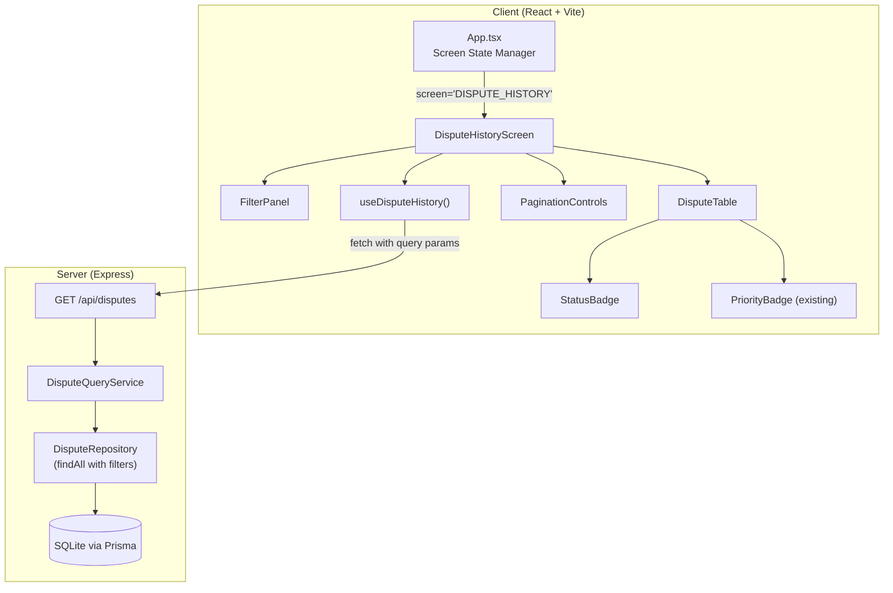
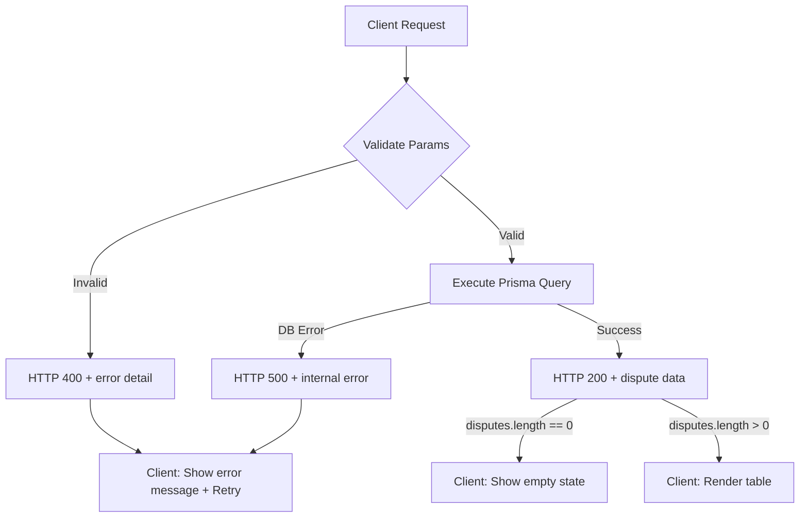

# Design Document: Dispute History View

## Overview

This feature adds a Dispute History View to the Payment Dispute Triage System — a dedicated screen for browsing, searching, filtering, sorting, and paginating all persisted dispute records. The implementation spans both client and server:

- **Server**: Extends the existing `GET /api/disputes` endpoint (from the dispute-persistence spec) with query parameters for customer name search, multi-field filtering, sorting, and pagination. The server handles all filtering/sorting/pagination logic, returning a page of results with metadata.
- **Client**: Adds a `DisputeHistoryScreen` component with a paginated table, filter panel, search input, and sort controls. Integrates into the existing state-based navigation (App.tsx) via both desktop side nav and mobile bottom nav.

Two entry points are provided:
1. **Global Dispute History** — accessible from the side/bottom navigation, showing all disputes.
2. **Customer-Specific History** — accessible from the customer selection screen via a "View History" link, pre-filtered to a single customer.

The feature builds on the dispute-persistence spec's data model and API, extending it without breaking existing functionality.

## Architecture



### Key Architectural Decisions

1. **Server-side pagination and filtering** — All filtering, sorting, and pagination is performed on the server via query parameters. The client never fetches all disputes at once. This keeps the client simple and ensures consistent performance regardless of dataset size.

2. **State-based navigation (no react-router)** — The application already uses a `Screen` union type in `App.tsx`. The history view is added as new screen states: `'DISPUTE_HISTORY'` (global) and `'CUSTOMER_DISPUTE_HISTORY'` (customer-specific). Navigation is managed by `setCurrentScreen`.

3. **Single API endpoint with query composition** — Rather than creating separate endpoints for global vs. customer-filtered views, the existing `GET /api/disputes` endpoint is extended with optional `customerName` and all filter params. The client composes the query string based on active filters.

4. **Debounced search** — Customer name search uses a 300ms debounce on the client to avoid excessive API calls during typing. The server performs case-insensitive partial matching via Prisma's `contains` with `mode: 'insensitive'`.

5. **Reuse of existing components** — The `PriorityBadge` component is reused directly. A new `StatusBadge` component is created following the same pattern. Formatting utilities (date, currency) are extracted into a shared utility module.

## Components and Interfaces

### Client Components

#### 1. DisputeHistoryScreen (`client/src/components/DisputeHistoryScreen.tsx`)

Top-level screen component for the dispute history view. Manages filter/sort/pagination state and delegates rendering to child components.

```typescript
interface DisputeHistoryScreenProps {
  customerId?: string;       // If provided, pre-filters to this customer
  customerName?: string;     // Display name for customer-specific heading
  onBack?: () => void;       // Back navigation (customer-specific mode)
  onProceed?: () => void;    // Proceed to capture (customer-specific mode)
}
```

#### 2. FilterPanel (`client/src/components/FilterPanel.tsx`)

Contains search input, filter dropdowns, date range inputs, and clear button.

```typescript
interface FilterPanelProps {
  filters: DisputeFilters;
  onFiltersChange: (filters: DisputeFilters) => void;
  onClear: () => void;
  activeFilterCount: number;
  disabled: boolean;
}

interface DisputeFilters {
  customerName: string;
  paymentType: string;
  issueCategory: string;
  priority: string;
  status: string;
  startDate: string;
  endDate: string;
}
```

#### 3. DisputeTable (`client/src/components/DisputeTable.tsx`)

Renders the dispute list as a table with sortable column headers.

```typescript
interface DisputeTableProps {
  disputes: DisputeListItem[];
  sortBy: SortField;
  sortOrder: SortOrder;
  onSort: (field: SortField) => void;
}

type SortField = 'createdAt' | 'priority' | 'status';
type SortOrder = 'asc' | 'desc';
```

#### 4. PaginationControls (`client/src/components/PaginationControls.tsx`)

Navigation buttons for paging through results.

```typescript
interface PaginationControlsProps {
  currentPage: number;
  totalPages: number;
  totalCount: number;
  onPageChange: (page: number) => void;
  disabled: boolean;
}
```

#### 5. StatusBadge (`client/src/components/StatusBadge.tsx`)

Displays dispute status with visual distinction per status value.

```typescript
interface StatusBadgeProps {
  status: 'OPEN' | 'TRIAGED' | 'CLOSED';
}
```

### Client Hooks

#### useDisputeHistory (`client/src/hooks/useDisputeHistory.ts`)

Custom hook encapsulating the dispute history API call with query parameter composition.

```typescript
interface UseDisputeHistoryParams {
  filters: DisputeFilters;
  sortBy: SortField;
  sortOrder: SortOrder;
  page: number;
  pageSize: number;
  customerId?: string;
}

interface UseDisputeHistoryResult {
  data: DisputeListResponse | null;
  loading: boolean;
  error: string | null;
  refetch: () => void;
}
```

### Client Utilities

#### formatters (`client/src/utils/formatters.ts`)

```typescript
export function formatDate(isoString: string): string;
// Returns "DD MMM YYYY" e.g. "22 Jun 2026"

export function formatCurrency(amount: number): string;
// Returns "R X,XXX.XX" e.g. "R 1,250.00"

export function formatPaymentType(type: PaymentType): string;
// Maps enum to display label

export function formatIssueCategory(category: IssueCategory): string;
// Maps enum to display label

export function formatRuleCount(count: number): string;
// Returns "N rule" or "N rules"
```

### Server Components

#### Extended GET /api/disputes Route (`server/src/routes/disputes.ts`)

Adds a `GET /` handler (mounted at `/api/disputes`) supporting:

| Parameter | Type | Default | Description |
|-----------|------|---------|-------------|
| customerName | string | — | Case-insensitive partial match on customer name |
| paymentType | string | — | Exact match (CARD, EFT, INTERNAL) |
| issueCategory | string | — | Exact match |
| priority | string | — | Exact match (HIGH, MEDIUM, LOW) |
| status | string | — | Exact match (OPEN, TRIAGED, CLOSED) |
| startDate | string | — | ISO 8601 date, filters createdAt >= startDate |
| endDate | string | — | ISO 8601 date, filters createdAt <= endDate (end of day) |
| sortBy | string | "createdAt" | Sort field: createdAt, priority, status |
| sortOrder | string | "desc" | Sort direction: asc, desc |
| page | integer | 1 | 1-based page number |
| pageSize | integer | 10 | Results per page (1–100) |

#### DisputeQueryService (`server/src/services/disputeQueryService.ts`)

Responsible for building Prisma where/orderBy/pagination clauses from validated query parameters.

```typescript
interface DisputeQueryParams {
  customerName?: string;
  paymentType?: string;
  issueCategory?: string;
  priority?: string;
  status?: string;
  startDate?: string;
  endDate?: string;
  sortBy: 'createdAt' | 'priority' | 'status';
  sortOrder: 'asc' | 'desc';
  page: number;
  pageSize: number;
}

interface DisputeListResponse {
  disputes: DisputeListItem[];
  totalCount: number;
  page: number;
  totalPages: number;
}

interface DisputeListItem {
  id: string;
  referenceNumber: string;
  status: string;
  priority: string;
  ageIndicator: string;
  paymentType: string;
  issueCategory: string;
  recommendedAction: string;
  createdAt: string;
  customerName: string;
  transactionAmount: number;
  triggeredRuleCount: number;
}
```

#### Query Parameter Validation (`server/src/services/disputeQueryValidator.ts`)

Validates and parses raw query string values into typed parameters. Returns validation errors for invalid inputs.

```typescript
interface ValidationResult {
  valid: boolean;
  params?: DisputeQueryParams;
  error?: { field: string; message: string };
}

export function validateDisputeQueryParams(query: Record<string, unknown>): ValidationResult;
```

## Data Models

### DisputeListItem (API Response Shape)

The `GET /api/disputes` endpoint returns a paginated response with flattened dispute records:

```typescript
interface DisputeListResponse {
  disputes: DisputeListItem[];
  totalCount: number;
  page: number;
  totalPages: number;
}

interface DisputeListItem {
  id: string;
  referenceNumber: string;
  status: 'OPEN' | 'TRIAGED' | 'CLOSED';
  priority: 'HIGH' | 'MEDIUM' | 'LOW';
  ageIndicator: 'NEW' | 'AGING' | 'OVERDUE';
  paymentType: 'CARD' | 'EFT' | 'INTERNAL';
  issueCategory: string;
  recommendedAction: string;
  createdAt: string;           // ISO 8601
  customerName: string;        // Joined from Customer relation
  transactionAmount: number;   // Joined from Transaction relation
  triggeredRuleCount: number;  // Count of triggered rules (parsed from JSON or relation count)
}
```

### Client-Side State Model

```typescript
interface DisputeHistoryState {
  filters: DisputeFilters;
  sortBy: SortField;
  sortOrder: SortOrder;
  currentPage: number;
  pageSize: number;  // Fixed at 10
}

const DEFAULT_STATE: DisputeHistoryState = {
  filters: {
    customerName: '',
    paymentType: '',
    issueCategory: '',
    priority: '',
    status: '',
    startDate: '',
    endDate: '',
  },
  sortBy: 'createdAt',
  sortOrder: 'desc',
  currentPage: 1,
  pageSize: 10,
};
```

### Priority Sort Ordering

For sorting by priority, the server maps priority values to numeric weights:

| Priority | Ascending Weight | Descending Weight |
|----------|-----------------|-------------------|
| HIGH | 1 | 3 |
| MEDIUM | 2 | 2 |
| LOW | 3 | 1 |

### Status Sort Ordering

For sorting by status, the server maps status values to numeric weights:

| Status | Ascending Weight | Descending Weight |
|--------|-----------------|-------------------|
| OPEN | 1 | 3 |
| TRIAGED | 2 | 2 |
| CLOSED | 3 | 1 |

### Updated Screen Type (App.tsx)

```typescript
type Screen =
  | 'SELECT_CUSTOMER'
  | 'SELECT_TRANSACTION'
  | 'CAPTURE_DISPUTE'
  | 'TRIAGE_RESULT'
  | 'DISPUTE_HISTORY'
  | 'CUSTOMER_DISPUTE_HISTORY';
```


## Correctness Properties

*A property is a characteristic or behavior that should hold true across all valid executions of a system — essentially, a formal statement about what the system should do. Properties serve as the bridge between human-readable specifications and machine-verifiable correctness guarantees.*

### Property 1: Filter AND logic — all returned disputes satisfy every active filter

*For any* combination of active filters (customerName, paymentType, issueCategory, priority, status, startDate, endDate) applied to any set of persisted disputes, every dispute in the API response SHALL satisfy ALL active filter conditions simultaneously: customer name contains the search term (case-insensitive), paymentType matches exactly, issueCategory matches exactly, priority matches exactly, status matches exactly, and createdAt falls within the date range.

**Validates: Requirements 2.2, 3.2, 3.5, 4.2, 4.3**

### Property 2: Sort ordering correctness

*For any* set of disputes returned by the API when sorted by a given field (createdAt, priority, or status) in a given direction (asc or desc), the results SHALL be in strictly non-decreasing (asc) or non-increasing (desc) order according to the defined orderings: createdAt uses chronological order, priority uses HIGH=1 < MEDIUM=2 < LOW=3, and status uses OPEN=1 < TRIAGED=2 < CLOSED=3.

**Validates: Requirements 5.2, 5.5, 5.6**

### Property 3: Date formatting produces DD MMM YYYY

*For any* valid ISO 8601 date-time string, the `formatDate` function SHALL produce a string matching the pattern "DD MMM YYYY" where DD is a zero-padded day (01–31), MMM is a three-letter English month abbreviation (Jan, Feb, ..., Dec), and YYYY is a four-digit year.

**Validates: Requirements 7.1**

### Property 4: Currency formatting produces R X,XXX.XX

*For any* non-negative number, the `formatCurrency` function SHALL produce a string starting with "R " followed by the integer part with comma-separated thousands and exactly two decimal places (e.g., 1250 → "R 1,250.00", 0.5 → "R 0.50").

**Validates: Requirements 7.2**

### Property 5: Rule count formatting uses correct singular/plural

*For any* positive integer N, the `formatRuleCount` function SHALL produce "1 rule" when N equals 1, and "N rules" for all other values of N.

**Validates: Requirements 7.5**

### Property 6: Page size invariant

*For any* valid API request to GET /api/disputes (regardless of filters, sort, or page number), the number of disputes in the response array SHALL be at most the requested pageSize (default 10), and SHALL equal min(pageSize, totalCount - (page-1) * pageSize) when the page is within bounds.

**Validates: Requirements 6.1, 1.1**

### Property 7: Pagination page buttons computation

*For any* values of currentPage (≥ 1) and totalPages (≥ 1), the pagination control SHALL display at most 5 page number buttons, centered around currentPage. The first displayed page SHALL be max(1, currentPage - 2) and the last SHALL be min(totalPages, firstPage + 4), with the range adjusted to always show up to 5 pages when totalPages ≥ 5.

**Validates: Requirements 6.2**

### Property 8: Date range validation rejects invalid ranges

*For any* pair of dates where startDate is strictly later than endDate, the filter panel SHALL reject the input with a validation error and SHALL NOT issue an API request. For any pair where startDate ≤ endDate, the filter SHALL be accepted.

**Validates: Requirements 4.7**

### Property 9: Invalid enum parameter returns HTTP 400

*For any* string value that is not a member of the valid enum set for a given parameter (status ∉ {OPEN, TRIAGED, CLOSED}, priority ∉ {HIGH, MEDIUM, LOW}, paymentType ∉ {CARD, EFT, INTERNAL}, issueCategory ∉ {DUPLICATE_DEBIT, FAILED_TRANSFER, MISSING_PAYMENT, UNAUTHORISED, INCORRECT_AMOUNT, CARD_DISPUTE}), the API SHALL return HTTP 400 with an error message identifying the invalid parameter.

**Validates: Requirements 10.5, 10.3**

### Property 10: Page beyond total returns empty array with valid metadata

*For any* requested page number that exceeds the total number of pages (calculated as ceil(totalCount / pageSize)), the API SHALL return HTTP 200 with an empty disputes array, the correct totalCount, the requested page number, and the correct totalPages value.

**Validates: Requirements 10.6**

### Property 11: Response shape completeness

*For any* successful API response from GET /api/disputes, every item in the disputes array SHALL contain all required fields (id, referenceNumber, status, priority, ageIndicator, paymentType, issueCategory, recommendedAction, createdAt, customerName, transactionAmount, triggeredRuleCount) as non-null values, and the response SHALL include totalCount (integer ≥ 0), page (integer ≥ 1), and totalPages (integer ≥ 0).

**Validates: Requirements 1.2, 10.4**

### Property 12: Query string omits unset parameters

*For any* client filter state, the constructed API request URL SHALL include only parameters whose values are non-empty strings or non-default values. Parameters with empty string values, null, or undefined SHALL be omitted from the query string entirely.

**Validates: Requirements 10.2**

### Property 13: Filter or sort change resets pagination to page 1

*For any* current page number > 1, when any filter value changes or the sort field/direction changes, the pagination state SHALL reset to page 1 before issuing the new API request.

**Validates: Requirements 6.5**

## Error Handling

### Client Error Handling

| Scenario | Behaviour | User Action |
|----------|-----------|-------------|
| API returns HTTP 4xx/5xx | Display error message in place of table, retain current page number | "Retry" button re-fetches same request |
| API request times out (30s) | Display timeout error message | "Retry" button re-fetches |
| Network failure (fetch rejects) | Display network error message | "Retry" button re-fetches |
| Empty result set (HTTP 200, 0 disputes) | Display empty state message (distinct from error), hide pagination | No action needed |
| Date range validation fails (start > end) | Inline validation error below date fields, API request not sent | User corrects date range |
| Search/filter during loading | Controls disabled (reduced opacity, no interaction) | User waits for current request |

### Server Error Handling

| Scenario | HTTP Status | Error Code | Response |
|----------|-------------|------------|----------|
| Invalid status value | 400 | INVALID_QUERY_PARAM | `{ "error": { "message": "Invalid value for 'status': must be OPEN, TRIAGED, or CLOSED", "code": "INVALID_QUERY_PARAM", "field": "status" } }` |
| Invalid priority value | 400 | INVALID_QUERY_PARAM | Same pattern with priority field |
| Invalid paymentType value | 400 | INVALID_QUERY_PARAM | Same pattern with paymentType field |
| Invalid issueCategory value | 400 | INVALID_QUERY_PARAM | Same pattern with issueCategory field |
| Invalid date format | 400 | INVALID_QUERY_PARAM | `{ "error": { "message": "Invalid date format for 'startDate': must be YYYY-MM-DD", "code": "INVALID_QUERY_PARAM", "field": "startDate" } }` |
| startDate > endDate | 400 | INVALID_QUERY_PARAM | `{ "error": { "message": "startDate must be before or equal to endDate", "code": "INVALID_QUERY_PARAM", "field": "startDate" } }` |
| page < 1 | 400 | INVALID_QUERY_PARAM | `{ "error": { "message": "page must be >= 1", "code": "INVALID_QUERY_PARAM", "field": "page" } }` |
| pageSize outside 1–100 | 400 | INVALID_QUERY_PARAM | `{ "error": { "message": "pageSize must be between 1 and 100", "code": "INVALID_QUERY_PARAM", "field": "pageSize" } }` |
| Database query failure | 500 | INTERNAL_ERROR | `{ "error": { "message": "Failed to retrieve disputes", "code": "INTERNAL_ERROR" } }` |

### Error Propagation Flow



## Testing Strategy

### Unit Tests (Vitest)

| Module | Test Focus |
|--------|-----------|
| `formatters.ts` | Date formatting, currency formatting, rule count formatting, label mappings |
| `disputeQueryValidator.ts` | Valid params pass, invalid enum values rejected, date format validation, page/pageSize bounds |
| `disputeQueryService.ts` | Prisma where clause construction, orderBy clause construction, pagination math |
| `DisputeHistoryScreen.tsx` | Renders heading, handles empty/loading/error states, calls hook with correct params |
| `FilterPanel.tsx` | Renders all controls, debounce on search, active filter count, date validation error |
| `DisputeTable.tsx` | Renders all columns, sort indicators, click handlers |
| `PaginationControls.tsx` | Page button computation, disabled states, page change callbacks |
| `StatusBadge.tsx` | Renders correct label/style for each status value |
| `useDisputeHistory.ts` | Query param construction, loading/error/success states, refetch |
| `GET /api/disputes` route | Filter combinations, sort orders, pagination, validation errors, empty results |

### Property-Based Tests (Vitest + fast-check)

Property-based tests use the `fast-check` library to verify universal properties across randomly generated inputs. Each property test runs a minimum of 100 iterations.

| Property | Test Description | Generator Strategy |
|----------|-----------------|-------------------|
| Property 1 | Filter AND logic | Generate random filter combinations + dispute sets, verify all results match all filters |
| Property 2 | Sort ordering | Generate random dispute arrays, apply sort, verify ordering invariant |
| Property 3 | Date formatting | Generate random Date objects (year 2000–2099), verify DD MMM YYYY pattern |
| Property 4 | Currency formatting | Generate random floats (0–999,999,999), verify R prefix + comma thousands + 2 decimals |
| Property 5 | Rule count formatting | Generate random integers (1–100), verify singular/plural |
| Property 6 | Page size invariant | Generate random (totalCount, page, pageSize) tuples, verify result length |
| Property 7 | Page buttons | Generate random (currentPage, totalPages) pairs, verify button range |
| Property 8 | Date range validation | Generate random date pairs, verify acceptance/rejection based on ordering |
| Property 9 | Invalid enum rejection | Generate random strings excluding valid values, verify 400 response |
| Property 10 | Page beyond total | Generate (disputeCount, pageSize, page) where page > ceil(count/pageSize) |
| Property 11 | Response shape | Generate random valid queries, verify all fields present |
| Property 12 | Query string construction | Generate random filter states, verify only non-empty params in URL |
| Property 13 | Page reset on filter change | Generate random state changes, verify page resets |

Tag format: **Feature: dispute-history-view, Property {N}: {title}**

### End-to-End Tests (Playwright)

| Flow | Assertions |
|------|-----------|
| Navigate to Dispute History via side nav | History screen loads, h1 visible, table displays disputes |
| Search by customer name | Debounced search filters results, clearing restores full list |
| Apply multiple filters | AND logic reduces results, "Clear Filters" resets, active filter count updates |
| Sort by columns | Clicking column header toggles sort, indicator moves correctly |
| Paginate through results | Previous/Next work, page numbers update, disabled at boundaries |
| Customer-specific history | View History link from customer select, only that customer's disputes shown |
| Error and retry | Simulate API failure, verify error message, click Retry, verify recovery |
| Mobile bottom nav | History item navigates to history screen, active indicator shown |
| Empty state | With no matching disputes, empty message shown, pagination hidden |

### Integration Tests

| Test | What it verifies |
|------|-----------------|
| GET /api/disputes with seeded data | Returns correct count, pagination metadata, and sorted results |
| Filter combinations against seeded data | Correct disputes returned for each filter |
| Sort ordering with seeded data | Results correctly ordered for each sortBy/sortOrder combo |
| Page beyond max | Returns empty array with correct totalCount and totalPages |
| Invalid params | Returns 400 with descriptive error for each invalid parameter type |
