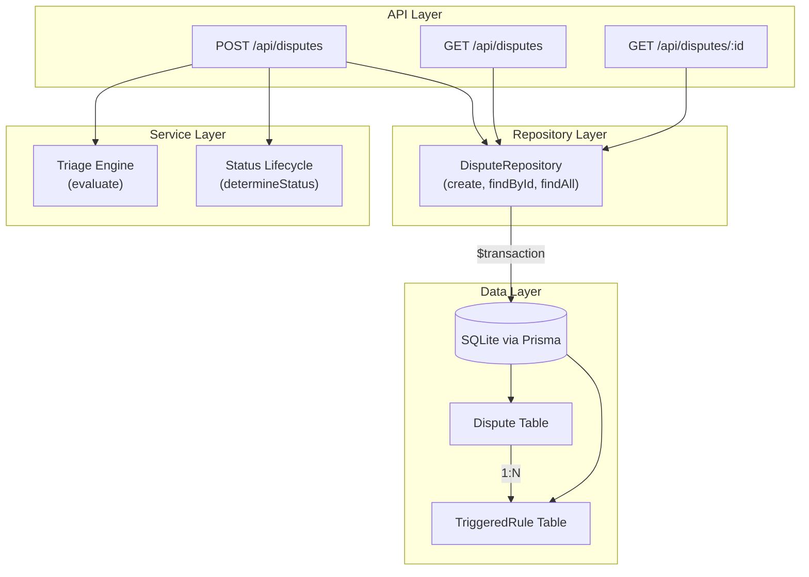
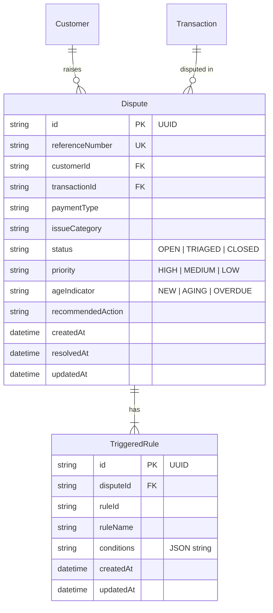

# Design Document: Dispute Persistence

## Overview

This feature transforms the Payment Dispute Triage System from an in-memory triage flow into a fully persistent system. Currently, disputes are created and triaged but the triggered rules are stored as a JSON blob string on the Dispute record. This design normalises triggered rules into a dedicated `TriggeredRule` table, implements proper status lifecycle management (OPEN → TRIAGED → CLOSED), enhances the seed script with pre-existing disputes, and updates the API to use Prisma interactive transactions for atomic writes.

The changes are server-side only (Prisma schema, repository layer, route handlers, seed script). The frontend response shape is preserved so the React client requires no changes.

## Architecture

The feature follows the existing layered architecture and introduces a formal repository layer for dispute persistence:



### Key Architectural Decisions

1. **Repository pattern** — Introduce `server/src/repositories/disputeRepository.ts` to encapsulate all Prisma queries for disputes and triggered rules. Route handlers remain thin.
2. **Prisma interactive transactions** — The dispute creation wraps both the Dispute insert and all TriggeredRule inserts in a single `prisma.$transaction()` call for atomicity.
3. **Status determined at creation time** — The status lifecycle logic (OPEN → TRIAGED → CLOSED) is computed before persistence, not as a state machine transition. Since disputes are created and triaged in a single request, the initial status is either TRIAGED (normal) or CLOSED (for CLOSE_RESOLVED recommendations).
4. **Cascade deletes via Prisma schema** — The `onDelete: Cascade` annotation on the TriggeredRule relation ensures orphan cleanup at the database level.

## Components and Interfaces

### 1. Prisma Schema Changes (`server/prisma/schema.prisma`)

**New model: TriggeredRule**

```prisma
model TriggeredRule {
  id         String   @id @default(uuid())
  disputeId  String
  ruleId     String
  ruleName   String
  conditions String   // JSON-encoded string
  createdAt  DateTime @default(now())
  updatedAt  DateTime @updatedAt

  dispute Dispute @relation(fields: [disputeId], references: [id], onDelete: Cascade)
}
```

**Modified model: Dispute** — Remove `triggeredRules String?` field, add relation:

```prisma
model Dispute {
  id                String   @id @default(uuid())
  referenceNumber   String   @unique
  customerId        String
  transactionId     String
  paymentType       String
  issueCategory     String
  status            String   @default("OPEN") // OPEN | TRIAGED | CLOSED
  priority          String   @default("LOW")
  ageIndicator      String   @default("NEW")
  recommendedAction String?
  createdAt         DateTime @default(now())
  resolvedAt        DateTime?
  updatedAt         DateTime @updatedAt

  customer       Customer       @relation(fields: [customerId], references: [id])
  transaction    Transaction    @relation(fields: [transactionId], references: [id])
  triggeredRules TriggeredRule[]
}
```

### 2. Dispute Repository (`server/src/repositories/disputeRepository.ts`)

```typescript
export interface CreateDisputeInput {
  referenceNumber: string;
  customerId: string;
  transactionId: string;
  paymentType: string;
  issueCategory: string;
  status: 'OPEN' | 'TRIAGED' | 'CLOSED';
  priority: string;
  ageIndicator: string;
  recommendedAction: string;
  resolvedAt: Date | null;
  triggeredRules: {
    ruleId: string;
    ruleName: string;
    conditions: Record<string, string | number>;
  }[];
}

export interface DisputeListFilter {
  status?: 'OPEN' | 'TRIAGED' | 'CLOSED';
}

export interface DisputeRepository {
  create(input: CreateDisputeInput): Promise<DisputeWithRules>;
  findById(id: string): Promise<DisputeWithRules | null>;
  findAll(filter?: DisputeListFilter): Promise<DisputeListItem[]>;
}
```

### 3. Status Lifecycle Service (`server/src/services/statusLifecycle.ts`)

```typescript
export type DisputeStatus = 'OPEN' | 'TRIAGED' | 'CLOSED';

export function determineInitialStatus(recommendationCode: string): {
  status: DisputeStatus;
  resolvedAt: Date | null;
};

export function validateStatusTransition(
  current: DisputeStatus,
  next: DisputeStatus
): boolean;
```

**Logic:**
- If `recommendationCode === 'CLOSE_RESOLVED'` → status = `CLOSED`, resolvedAt = now
- Otherwise → status = `TRIAGED`, resolvedAt = null

**Valid transitions:** OPEN → TRIAGED, OPEN → CLOSED, TRIAGED → CLOSED

### 4. Updated Route Handler (`server/src/routes/disputes.ts`)

The POST handler is updated to:
1. Validate input (existing logic)
2. Call triage engine (existing logic)
3. Determine status via lifecycle service
4. Call `disputeRepository.create()` which uses a Prisma transaction
5. Return response with `triggeredRules` as array of objects (parsed from relation)

New GET `/api/disputes` endpoint added for listing with optional status filter.

### 5. Seed Script Enhancement (`server/prisma/seed.ts`)

The seed script adds:
- Deletion of `TriggeredRule` records before `Dispute` records (FK order)
- 6+ dispute records covering OPEN, TRIAGED, CLOSED statuses
- Associated TriggeredRule records for each dispute
- Coverage of varied priorities, age indicators, and recommendation codes

## Data Models

### TriggeredRule Entity

| Field | Type | Constraints | Description |
|-------|------|-------------|-------------|
| id | String | PK, UUID, auto-generated | Unique identifier |
| disputeId | String | FK → Dispute.id, NOT NULL | Parent dispute reference |
| ruleId | String | NOT NULL, max 20 chars | Rule identifier (e.g., `RULE-002`) |
| ruleName | String | NOT NULL, max 100 chars | Human-readable rule name |
| conditions | String | NOT NULL, max 1000 chars | JSON-serialised conditions object |
| createdAt | DateTime | auto-generated | Record creation timestamp |
| updatedAt | DateTime | auto-updated | Last modification timestamp |

### Updated Dispute Entity

| Field | Type | Change | Description |
|-------|------|--------|-------------|
| triggeredRules | TriggeredRule[] | **Replaced** `String?` with relation | One-to-many relation to TriggeredRule |
| status | String | **Unchanged** but now lifecycle-managed | OPEN / TRIAGED / CLOSED |
| resolvedAt | DateTime? | **Unchanged** but now set programmatically | Set when status = CLOSED |

### Entity Relationship



### API Response Shapes

**POST /api/disputes response (unchanged shape):**
```json
{
  "disputeId": "uuid",
  "referenceNumber": "DSP-001",
  "status": "TRIAGED",
  "triage": {
    "recommendation": "Immediate Reversal",
    "recommendationCode": "IMMEDIATE_REVERSAL",
    "priority": "LOW",
    "ageIndicator": "NEW",
    "rulesTriggered": [
      {
        "ruleId": "RULE-002",
        "ruleName": "Card + Duplicate Debit",
        "conditions": { "paymentType": "CARD", "issueCategory": "DUPLICATE_DEBIT" }
      }
    ]
  }
}
```

**GET /api/disputes response (new):**
```json
{
  "disputes": [
    {
      "id": "uuid",
      "referenceNumber": "DSP-001",
      "status": "TRIAGED",
      "priority": "LOW",
      "ageIndicator": "NEW",
      "paymentType": "CARD",
      "issueCategory": "DUPLICATE_DEBIT",
      "recommendedAction": "Immediate Reversal",
      "createdAt": "2026-06-22T14:30:00.000Z",
      "customerName": "Thabo Molefe",
      "transactionAmount": 1250.00,
      "triggeredRuleCount": 1
    }
  ]
}
```


## Correctness Properties

*A property is a characteristic or behavior that should hold true across all valid executions of a system — essentially, a formal statement about what the system should do. Properties serve as the bridge between human-readable specifications and machine-verifiable correctness guarantees.*

### Property 1: Dispute creation round-trip preserves all fields

*For any* valid triage input (with valid paymentType, issueCategory, and an existing transaction), creating a dispute via `POST /api/disputes` SHALL persist a record whose referenceNumber, customerId, transactionId, paymentType, issueCategory, status, priority, ageIndicator, recommendedAction, and triggeredRules all match the values computed by the triage engine, and the API response SHALL include those same values.

**Validates: Requirements 1.1, 6.1, 6.4**

### Property 2: Status lifecycle is determined by recommendation code

*For any* valid dispute where the triage engine produces a recommendationCode other than CLOSE_RESOLVED, the persisted dispute SHALL have status = TRIAGED and resolvedAt = null. For any dispute where the recommendationCode is CLOSE_RESOLVED, the persisted dispute SHALL have status = CLOSED and resolvedAt set to a non-null timestamp.

**Validates: Requirements 1.3, 3.1, 3.2, 3.3**

### Property 3: Status field is restricted to valid values and transitions

*For any* attempted status value that is not one of OPEN, TRIAGED, or CLOSED, the system SHALL reject it. For any attempted status transition that does not follow OPEN → TRIAGED, OPEN → CLOSED, or TRIAGED → CLOSED, the system SHALL reject the transition.

**Validates: Requirements 3.4, 3.5**

### Property 4: Triggered rule count matches triage engine output

*For any* dispute created through the system, the number of TriggeredRule records associated with that dispute SHALL equal the number of rules fired by the triage engine (minimum 1), and the records SHALL be ordered by rule evaluation priority when retrieved.

**Validates: Requirements 2.2, 2.3**

### Property 5: Cascade delete removes all associated triggered rules

*For any* dispute with N associated TriggeredRule records (where N ≥ 1), deleting the dispute SHALL result in zero TriggeredRule records remaining with that disputeId.

**Validates: Requirements 2.4, 4.5**

### Property 6: Conditions serialization round-trip

*For any* valid conditions object (containing string or number values), storing it as a JSON-serialised string in the TriggeredRule.conditions field and then retrieving it via the API SHALL produce an object equivalent to the original conditions input.

**Validates: Requirements 6.2, 6.5**

### Property 7: Dispute list is ordered by createdAt descending

*For any* set of persisted disputes, querying GET /api/disputes SHALL return them in strictly non-increasing createdAt order.

**Validates: Requirements 7.1**

### Property 8: Status filter returns only matching disputes

*For any* valid status value S in {OPEN, TRIAGED, CLOSED}, querying GET /api/disputes?status=S SHALL return only disputes whose status equals S, with each result including customerName, transactionAmount, and triggeredRuleCount fields.

**Validates: Requirements 7.2, 7.3**

### Property 9: Invalid status query parameter returns 400

*For any* string that is not one of OPEN, TRIAGED, or CLOSED, querying GET /api/disputes?status={invalid} SHALL return HTTP 400.

**Validates: Requirements 7.5**

## Error Handling

### Transaction Rollback on Failure

The Prisma interactive transaction ensures atomicity:
- If the Dispute insert succeeds but any TriggeredRule insert fails, the entire transaction rolls back.
- No partial state is visible to other queries.
- The API returns HTTP 500 with an error message indicating the dispute could not be saved.

### Validation Errors

| Scenario | HTTP Status | Error Code | Description |
|----------|-------------|------------|-------------|
| Missing required fields (transactionId, paymentType, issueCategory) | 400 | VALIDATION_ERROR | Lists missing fields |
| Invalid paymentType value | 422 | INVALID_PAYMENT_TYPE | Value not in allowed set |
| Invalid issueCategory value | 422 | INVALID_ISSUE_CATEGORY | Value not in allowed set |
| Transaction not found | 404 | TRANSACTION_NOT_FOUND | No transaction with given ID |
| Invalid status query parameter | 400 | INVALID_STATUS | Value not OPEN/TRIAGED/CLOSED |
| Dispute not found (GET by ID) | 404 | DISPUTE_NOT_FOUND | No dispute with given ID |
| Reference number collision (after retries) | 500 | REFERENCE_NUMBER_CONFLICT | Exhausted retry attempts |
| Database transaction failure | 500 | PERSISTENCE_ERROR | Transaction rolled back |

### Error Response Shape

All errors follow the existing `errorHandler` middleware pattern:

```json
{
  "error": {
    "message": "Human-readable description",
    "code": "MACHINE_READABLE_CODE",
    "fields": ["field1", "field2"]
  }
}
```

## Testing Strategy

### Unit Tests (Vitest)

| Module | Test Focus |
|--------|-----------|
| `statusLifecycle.ts` | determineInitialStatus for each recommendation code; validateStatusTransition for all pairs |
| `disputeRepository.ts` | Create with rules (mock Prisma), findById includes rules, findAll with/without filter |
| `disputes.ts` (route) | POST validation, POST success response shape, GET list with filter, GET by ID |
| Seed script | Verify dispute/rule counts, status coverage, FK integrity |

### Property-Based Tests (Vitest + fast-check)

Property-based tests use the `fast-check` library to verify universal properties across randomly generated inputs. Each property test runs a minimum of 100 iterations.

| Property | Test Description | Generator Strategy |
|----------|-----------------|-------------------|
| Property 1 | Create dispute round-trip | Generate random valid (paymentType, issueCategory, transactionId) tuples |
| Property 2 | Status lifecycle | Generate random recommendation codes, verify status/resolvedAt |
| Property 3 | Status validation | Generate arbitrary strings and status pairs |
| Property 4 | Triggered rule count | Generate triage results with 1–5 rules |
| Property 5 | Cascade delete | Generate disputes with 1–5 rules, delete, verify cleanup |
| Property 6 | Conditions round-trip | Generate random Record<string, string\|number> objects |
| Property 7 | List ordering | Generate N disputes with varying timestamps |
| Property 8 | Status filter | Generate mixed-status dispute sets, filter by each |
| Property 9 | Invalid status | Generate arbitrary non-valid status strings |

Tag format: `Feature: dispute-persistence, Property {N}: {title}`

### End-to-End Tests (Playwright)

| Flow | Assertions |
|------|-----------|
| Full dispute capture → triage result | Dispute persisted with correct status, rules visible on result screen |
| Query disputes list with status filter | Only matching disputes returned |
| Create CLOSE_RESOLVED dispute | Status shown as CLOSED, resolvedAt populated |

### Integration Tests

| Test | What it verifies |
|------|-----------------|
| Seed script idempotency | Running seed twice produces consistent data |
| Migration preserves existing data | Customer and Transaction rows survive migration |
| Cascade delete at DB level | Deleting a Dispute removes TriggeredRule rows |
