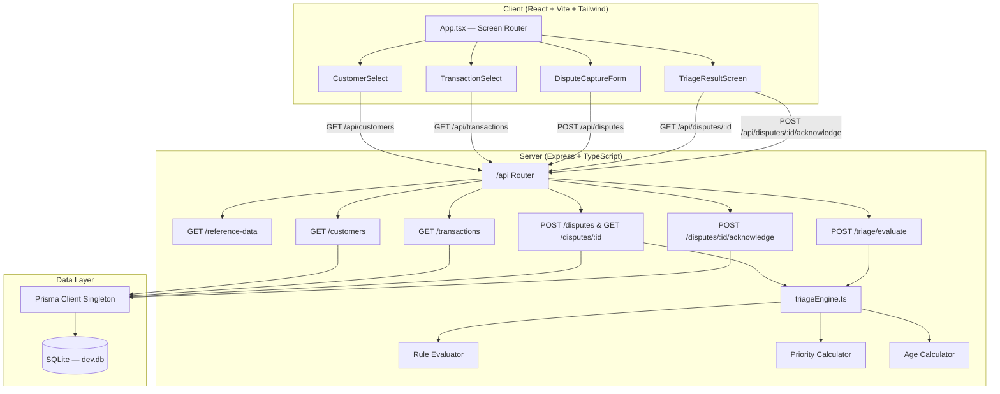
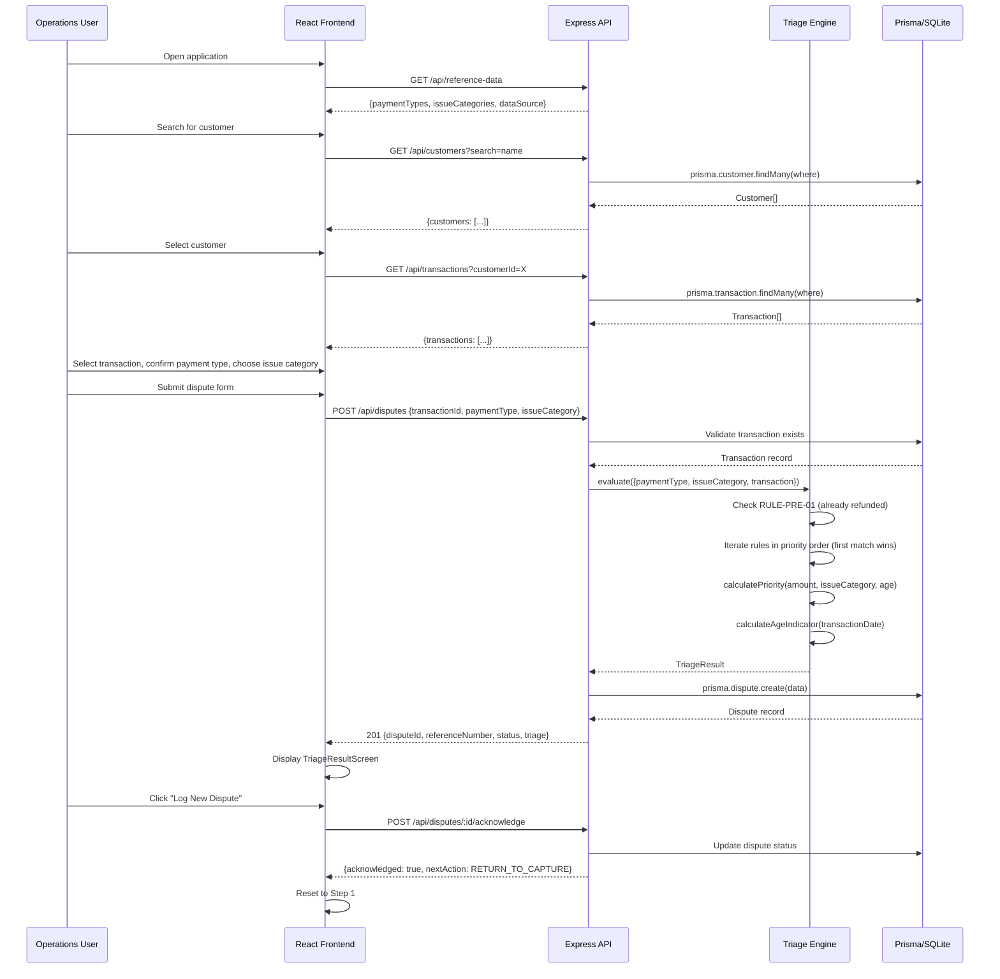

# Design Document: Payment Dispute Triage System

## Overview

The Payment Dispute Triage System is an internal full-stack application that automates the routing of customer payment disputes for banking operations staff. An operations user selects a customer and transaction, captures dispute details (payment type + issue category), and receives a deterministic recommendation produced by a static rules engine evaluating a priority-ordered decision matrix. The system assigns priority (HIGH/MEDIUM/LOW) and age (NEW/AGING/OVERDUE) indicators independently, then displays the full triage result—recommendation, triggered rules, decision factors, and badges—on a single screen.

The architecture follows a layered model: Express route handlers delegate to framework-agnostic services, which query Prisma (SQLite). The React frontend progresses through four sequential screens using custom hooks for API communication. All data is local mock data with no external integrations.

## Architecture



## Sequence Diagrams

### Main Dispute Flow



## Components and Interfaces

### Backend Components

#### Component: Triage Engine Service

**Purpose**: Evaluates disputes against the decision matrix and calculates priority/age indicators. Pure business logic with no HTTP or database concerns.

**Interface**:
```typescript
interface TriageInput {
  paymentType: 'CARD' | 'EFT' | 'INTERNAL';
  issueCategory: string;
  transactionStatus: string;
  transactionAmount: number;
  transactionDate: Date;
}

interface RuleTriggered {
  ruleId: string;
  ruleName: string;
  conditions: Record<string, string | number>;
}

interface TriageResult {
  recommendation: string;
  recommendationCode: string;
  priority: 'HIGH' | 'MEDIUM' | 'LOW';
  ageIndicator: 'NEW' | 'AGING' | 'OVERDUE';
  rulesTriggered: RuleTriggered[];
}

interface TriageEngine {
  evaluate(input: TriageInput): TriageResult;
  calculatePriority(amount: number, issueCategory: string, ageInDays: number): 'HIGH' | 'MEDIUM' | 'LOW';
  calculateAgeIndicator(transactionDate: Date): 'NEW' | 'AGING' | 'OVERDUE';
}
```

**Responsibilities**:
- Evaluate the decision matrix rules in priority order (first match wins)
- Short-circuit on ALREADY_REFUNDED status before other rules
- Calculate priority independently of recommendation
- Calculate age indicator from transaction date
- Return triggered rules with matched conditions for transparency

#### Component: API Route Handlers

**Purpose**: Thin HTTP layer that validates input, calls services, formats responses.

**Interface**:
```typescript
// Routes mounted on /api
// GET  /reference-data       → referenceDataRouter
// GET  /customers            → customersRouter
// GET  /transactions         → transactionsRouter
// POST /disputes             → disputesRouter
// GET  /disputes/:id         → disputesRouter
// POST /disputes/:id/acknowledge → disputesRouter
// POST /triage/evaluate      → triageRouter
```

**Responsibilities**:
- Parse and validate request parameters/body
- Call appropriate service functions
- Map service responses to HTTP status codes
- Delegate errors to errorHandler middleware

#### Component: Error Handler Middleware

**Purpose**: Centralized Express error handling.

**Interface**:
```typescript
interface AppError extends Error {
  statusCode: number;
  code?: string;
}

type ErrorHandler = (
  err: Error | AppError,
  req: Request,
  res: Response,
  next: NextFunction
) => void;
```

**Responsibilities**:
- Catch all unhandled errors from route handlers
- Return consistent JSON error responses
- Log errors for debugging
- Map known error types to appropriate HTTP status codes

### Frontend Components

#### Component: App (Screen Router)

**Purpose**: Manages the 4-step screen flow and shared state.

**Interface**:
```typescript
type Screen = 'SELECT_CUSTOMER' | 'SELECT_TRANSACTION' | 'CAPTURE_DISPUTE' | 'TRIAGE_RESULT';

interface AppState {
  currentScreen: Screen;
  selectedCustomer: Customer | null;
  selectedTransaction: Transaction | null;
  disputeResult: DisputeResponse | null;
}
```

#### Component: CustomerSelect

**Purpose**: Search and select a customer from the mock dataset.

**Interface**:
```typescript
interface CustomerSelectProps {
  onSelect: (customer: Customer) => void;
}
```

#### Component: TransactionSelect

**Purpose**: Display transactions for the selected customer, allow selection.

**Interface**:
```typescript
interface TransactionSelectProps {
  customerId: string;
  onSelect: (transaction: Transaction) => void;
  onBack: () => void;
}
```

#### Component: DisputeCaptureForm

**Purpose**: Capture payment type confirmation and issue category, submit dispute.

**Interface**:
```typescript
interface DisputeCaptureFormProps {
  customer: Customer;
  transaction: Transaction;
  onSubmit: (result: DisputeResponse) => void;
  onBack: () => void;
}
```

#### Component: TriageResultScreen

**Purpose**: Display triage recommendation, rules, badges, and decision factors.

**Interface**:
```typescript
interface TriageResultScreenProps {
  disputeId: string;
  onNewDispute: () => void;
}
```

#### Component: PriorityBadge & AgeBadge

**Purpose**: Visual colour-coded indicators.

**Interface**:
```typescript
interface PriorityBadgeProps {
  priority: 'HIGH' | 'MEDIUM' | 'LOW';
}

interface AgeBadgeProps {
  ageIndicator: 'NEW' | 'AGING' | 'OVERDUE';
}
```

## Data Models

### TypeScript Interfaces (Shared)

```typescript
// Payment type and issue category enums
type PaymentType = 'CARD' | 'EFT' | 'INTERNAL';

type IssueCategory =
  | 'DUPLICATE_DEBIT'
  | 'FAILED_TRANSFER'
  | 'MISSING_PAYMENT'
  | 'UNAUTHORISED'
  | 'INCORRECT_AMOUNT'
  | 'CARD_DISPUTE';

type TransactionStatus = 'COMPLETED' | 'PENDING' | 'FAILED' | 'ALREADY_REFUNDED';

type DisputeStatus = 'OPEN' | 'TRIAGED' | 'CLOSED';

type Priority = 'HIGH' | 'MEDIUM' | 'LOW';

type AgeIndicator = 'NEW' | 'AGING' | 'OVERDUE';

type RecommendationCode =
  | 'CLOSE_RESOLVED'
  | 'ESCALATE_FRAUD'
  | 'IMMEDIATE_REVERSAL'
  | 'MONITOR_24H'
  | 'ESCALATE_SENIOR'
  | 'REFER_PAYMENTS'
  | 'INVESTIGATE';

// Domain models
interface Customer {
  id: string;
  name: string;
  email: string;
  accountNumber: string;
}

interface Transaction {
  id: string;
  customerId: string;
  amount: number;
  paymentType: PaymentType;
  status: TransactionStatus;
  description: string;
  transactionDate: string;
}

interface RuleTriggered {
  ruleId: string;
  ruleName: string;
  conditions: Record<string, string | number>;
}

interface TriageResult {
  recommendation: string;
  recommendationCode: RecommendationCode;
  priority: Priority;
  ageIndicator: AgeIndicator;
  rulesTriggered: RuleTriggered[];
}

interface DisputeResponse {
  disputeId: string;
  referenceNumber: string;
  status: DisputeStatus;
  triage: TriageResult;
}

interface DisputeDetail {
  disputeId: string;
  referenceNumber: string;
  status: DisputeStatus;
  paymentType: PaymentType;
  issueCategory: IssueCategory;
  priority: Priority;
  ageIndicator: AgeIndicator;
  recommendation: string;
  recommendationCode: RecommendationCode;
  rulesTriggered: RuleTriggered[];
  transaction: Transaction;
  customer: Customer;
  createdAt: string;
}
```

**Validation Rules**:
- `paymentType` must be one of: CARD, EFT, INTERNAL
- `issueCategory` must be one of the 6 defined categories
- `transactionId` must reference an existing transaction
- `amount` is always positive (enforced by seed data)
- `transactionDate` is always in the past (enforced by seed data)

## Key Functions with Formal Specifications

### Function: evaluate()

```typescript
function evaluate(input: TriageInput): TriageResult
```

**Preconditions:**
- `input.paymentType` is one of 'CARD' | 'EFT' | 'INTERNAL'
- `input.issueCategory` is a valid IssueCategory
- `input.transactionStatus` is a valid TransactionStatus
- `input.transactionAmount` is a positive number
- `input.transactionDate` is a valid Date in the past

**Postconditions:**
- Returns exactly one `TriageResult` (never null, never throws for valid input)
- `result.recommendationCode` is one of the 7 valid RecommendationCode values
- `result.rulesTriggered` contains at least one rule (the matching rule)
- `result.priority` is computed independently of `result.recommendationCode`
- `result.ageIndicator` is computed from `input.transactionDate`
- If `input.transactionStatus === 'ALREADY_REFUNDED'`, then `result.recommendationCode === 'CLOSE_RESOLVED'` and no other rules are evaluated

**Loop Invariants:**
- Rules are evaluated in strict priority order (0, 1, 2, ..., 99)
- Once a rule matches, iteration stops (first-match-wins)
- The default rule (priority 99) always matches if no other rule did

### Function: calculatePriority()

```typescript
function calculatePriority(
  amount: number,
  issueCategory: string,
  ageInDays: number
): Priority
```

**Preconditions:**
- `amount` is a positive number
- `issueCategory` is a valid IssueCategory string
- `ageInDays` is a non-negative integer

**Postconditions:**
- Returns 'HIGH' if `amount > 10000` OR `issueCategory === 'UNAUTHORISED'`
- Returns 'MEDIUM' if `amount >= 5000 && amount <= 10000` OR `ageInDays > 7`
- Returns 'LOW' in all other cases
- If multiple conditions match, the highest priority wins (HIGH > MEDIUM > LOW)

**Loop Invariants:** N/A (direct conditional logic, no loops)

### Function: calculateAgeIndicator()

```typescript
function calculateAgeIndicator(transactionDate: Date): AgeIndicator
```

**Preconditions:**
- `transactionDate` is a valid Date object
- `transactionDate` is in the past or today

**Postconditions:**
- Returns 'NEW' if days since transaction is 0–7
- Returns 'AGING' if days since transaction is 8–14
- Returns 'OVERDUE' if days since transaction is > 14
- Calculation uses calendar days (not business days)

**Loop Invariants:** N/A (direct conditional logic)

## Algorithmic Pseudocode

### Rules Engine Evaluation Algorithm

```typescript
const RULES: Rule[] = [
  { priority: 0, id: 'RULE-PRE-01', name: 'Already Refunded',
    match: (input) => input.transactionStatus === 'ALREADY_REFUNDED',
    action: 'CLOSE_RESOLVED', label: 'Close Dispute — Resolved' },
  { priority: 1, id: 'RULE-001', name: 'Unauthorised (Fraud)',
    match: (input) => input.issueCategory === 'UNAUTHORISED',
    action: 'ESCALATE_FRAUD', label: 'Escalate to Fraud Team' },
  { priority: 2, id: 'RULE-002', name: 'Card + Duplicate Debit',
    match: (input) => input.paymentType === 'CARD' && input.issueCategory === 'DUPLICATE_DEBIT',
    action: 'IMMEDIATE_REVERSAL', label: 'Immediate Reversal' },
  { priority: 3, id: 'RULE-003', name: 'EFT + Pending',
    match: (input) => input.paymentType === 'EFT' && input.transactionStatus === 'PENDING',
    action: 'MONITOR_24H', label: 'Monitor for 24 Hours' },
  { priority: 4, id: 'RULE-004', name: 'High Value (>R10,000)',
    match: (input) => input.transactionAmount > 10000,
    action: 'ESCALATE_SENIOR', label: 'Escalate to Senior Ops' },
  { priority: 5, id: 'RULE-005', name: 'Internal + Failed Transfer',
    match: (input) => input.paymentType === 'INTERNAL' && input.issueCategory === 'FAILED_TRANSFER',
    action: 'REFER_PAYMENTS', label: 'Refer to Payments Team' },
  { priority: 6, id: 'RULE-006', name: 'EFT + Missing Payment',
    match: (input) => input.paymentType === 'EFT' && input.issueCategory === 'MISSING_PAYMENT',
    action: 'INVESTIGATE', label: 'Investigate Further' },
  { priority: 7, id: 'RULE-007', name: 'Card + Card Dispute',
    match: (input) => input.paymentType === 'CARD' && input.issueCategory === 'CARD_DISPUTE',
    action: 'INVESTIGATE', label: 'Investigate Further' },
  { priority: 8, id: 'RULE-008', name: 'Incorrect Amount',
    match: (input) => input.issueCategory === 'INCORRECT_AMOUNT',
    action: 'INVESTIGATE', label: 'Investigate Further' },
  { priority: 99, id: 'RULE-DEFAULT', name: 'Default — Manual Review',
    match: () => true,
    action: 'INVESTIGATE', label: 'Investigate Further — Manual Review Required' },
];

function evaluate(input: TriageInput): TriageResult {
  // Rules are pre-sorted by priority (ascending)
  // First-match-wins: iterate until a match is found
  let matchedRule: Rule | null = null;

  for (const rule of RULES) {
    if (rule.match(input)) {
      matchedRule = rule;
      break; // First match wins
    }
  }

  // Default rule guarantees matchedRule is never null
  const recommendation = matchedRule!.label;
  const recommendationCode = matchedRule!.action;

  // Priority and age are independent of recommendation
  const ageInDays = calculateDaysBetween(input.transactionDate, new Date());
  const priority = calculatePriority(input.transactionAmount, input.issueCategory, ageInDays);
  const ageIndicator = calculateAgeIndicator(input.transactionDate);

  // Build triggered rule detail with matched conditions
  const rulesTriggered: RuleTriggered[] = [{
    ruleId: matchedRule!.id,
    ruleName: matchedRule!.name,
    conditions: extractMatchedConditions(matchedRule!, input),
  }];

  return { recommendation, recommendationCode, priority, ageIndicator, rulesTriggered };
}
```

### Priority Calculator Algorithm

```typescript
function calculatePriority(
  amount: number,
  issueCategory: string,
  ageInDays: number
): Priority {
  // HIGH takes precedence
  if (amount > 10000 || issueCategory === 'UNAUTHORISED') {
    return 'HIGH';
  }

  // MEDIUM conditions
  if ((amount >= 5000 && amount <= 10000) || ageInDays > 7) {
    return 'MEDIUM';
  }

  // All other cases
  return 'LOW';
}
```

### Age Indicator Calculator Algorithm

```typescript
function calculateAgeIndicator(transactionDate: Date): AgeIndicator {
  const now = new Date();
  const diffMs = now.getTime() - transactionDate.getTime();
  const diffDays = Math.floor(diffMs / (1000 * 60 * 60 * 24));

  if (diffDays <= 7) return 'NEW';
  if (diffDays <= 14) return 'AGING';
  return 'OVERDUE';
}
```

## Example Usage

```typescript
// Example 1: Card + Duplicate Debit → Immediate Reversal
const result1 = evaluate({
  paymentType: 'CARD',
  issueCategory: 'DUPLICATE_DEBIT',
  transactionStatus: 'COMPLETED',
  transactionAmount: 1250,
  transactionDate: new Date('2026-06-20'),
});
// result1.recommendationCode === 'IMMEDIATE_REVERSAL'
// result1.priority === 'LOW'
// result1.ageIndicator === 'NEW'

// Example 2: Unauthorised → Escalate Fraud (highest priority rule)
const result2 = evaluate({
  paymentType: 'EFT',
  issueCategory: 'UNAUTHORISED',
  transactionStatus: 'COMPLETED',
  transactionAmount: 8000,
  transactionDate: new Date('2026-06-10'),
});
// result2.recommendationCode === 'ESCALATE_FRAUD'
// result2.priority === 'HIGH'  (UNAUTHORISED triggers HIGH)
// result2.ageIndicator === 'AGING' (10+ days)

// Example 3: Already Refunded → Close Resolved (pre-check short-circuit)
const result3 = evaluate({
  paymentType: 'CARD',
  issueCategory: 'UNAUTHORISED', // Even fraud — doesn't matter
  transactionStatus: 'ALREADY_REFUNDED',
  transactionAmount: 50000,
  transactionDate: new Date('2026-06-01'),
});
// result3.recommendationCode === 'CLOSE_RESOLVED'
// result3.priority === 'HIGH' (amount > 10000 and UNAUTHORISED)
// result3.ageIndicator === 'OVERDUE'

// Example 4: High-value EFT + Missing Payment
const result4 = evaluate({
  paymentType: 'EFT',
  issueCategory: 'MISSING_PAYMENT',
  transactionStatus: 'COMPLETED',
  transactionAmount: 15000,
  transactionDate: new Date('2026-06-18'),
});
// result4.recommendationCode === 'ESCALATE_SENIOR' (RULE-004 priority 4 > RULE-006 priority 6)
// result4.priority === 'HIGH' (amount > 10000)
// result4.ageIndicator === 'NEW'

// Example 5: API call from frontend hook
const response = await fetch('/api/disputes', {
  method: 'POST',
  headers: { 'Content-Type': 'application/json' },
  body: JSON.stringify({
    transactionId: 'txn-001',
    paymentType: 'CARD',
    issueCategory: 'DUPLICATE_DEBIT',
  }),
});
const data: DisputeResponse = await response.json();
// Navigate to result screen with data.disputeId
```

## Error Handling

### Error Scenario 1: Transaction Not Found

**Condition**: POST /api/disputes with a `transactionId` that doesn't exist in the database
**Response**: 404 status with `{ error: "Transaction not found", code: "TRANSACTION_NOT_FOUND" }`
**Recovery**: Frontend displays error message, user can re-select a transaction

### Error Scenario 2: Invalid Payment Type or Issue Category

**Condition**: POST /api/disputes with an unrecognized `paymentType` or `issueCategory`
**Response**: 422 status with `{ error: "Invalid payment type", code: "INVALID_INPUT" }`
**Recovery**: Frontend shows validation error, user corrects selection

### Error Scenario 3: Missing Required Fields

**Condition**: POST /api/disputes missing `transactionId`, `paymentType`, or `issueCategory`
**Response**: 400 status with `{ error: "Missing required fields", fields: ["paymentType"] }`
**Recovery**: Frontend shows inline validation errors on offending fields

### Error Scenario 4: Dispute Not Found (Acknowledge)

**Condition**: POST /api/disputes/:id/acknowledge with non-existent dispute ID
**Response**: 404 status with `{ error: "Dispute not found", code: "DISPUTE_NOT_FOUND" }`
**Recovery**: Frontend navigates back to capture screen

### Error Scenario 5: Server/Database Error

**Condition**: Prisma query failure or unexpected server error
**Response**: 500 status with `{ error: "Internal server error", code: "INTERNAL_ERROR" }`
**Recovery**: Frontend shows generic error with retry option

## Testing Strategy

### Unit Testing Approach

- **Rules Engine**: Test every rule path individually with targeted inputs. Verify first-match-wins semantics by testing overlapping conditions.
- **Priority Calculator**: Test all boundary conditions (4999, 5000, 10000, 10001), UNAUTHORISED override, age > 7 days.
- **Age Calculator**: Test boundaries (day 7, day 8, day 14, day 15), same-day transactions.
- **Route Handlers**: Mock Prisma client, verify correct status codes and response shapes.

### Property-Based Testing Approach

**Property Test Library**: fast-check (via Vitest)

Key properties:
1. Every valid input to `evaluate()` produces exactly one recommendation (totality)
2. The recommendation code is always from the valid set of 7 codes (range validity)
3. Priority is independent of recommendation — same amount/issue/age always yields same priority regardless of payment type
4. Age indicator depends only on transaction date, not on other inputs
5. ALREADY_REFUNDED always produces CLOSE_RESOLVED regardless of other inputs
6. First-match-wins ordering: if RULE-001 conditions are met, the result is always ESCALATE_FRAUD regardless of lower-priority rule conditions also being true

### Integration Testing Approach

- Test full API request/response cycle for each endpoint
- Use a test database with known seed data
- Verify dispute creation persists correctly and returns triage result
- Test the acknowledge flow end-to-end

## Correctness Properties

*A property is a characteristic or behavior that should hold true across all valid executions of a system — essentially, a formal statement about what the system should do. Properties serve as the bridge between human-readable specifications and machine-verifiable correctness guarantees.*

### Property 1: Evaluation Totality

*For any* valid TriageInput (valid paymentType, valid issueCategory, valid transactionStatus, positive amount, past transactionDate), the evaluate() function SHALL return exactly one TriageResult with a non-null recommendation and a recommendationCode from the set {CLOSE_RESOLVED, ESCALATE_FRAUD, IMMEDIATE_REVERSAL, MONITOR_24H, ESCALATE_SENIOR, REFER_PAYMENTS, INVESTIGATE}.

**Validates: Requirements 5.1, 5.2**

### Property 2: First-Match-Wins Rule Ordering

*For any* valid TriageInput where multiple rules' conditions are satisfied, the evaluate() function SHALL return the recommendation of the rule with the lowest priority number (highest precedence). Specifically, if UNAUTHORISED is the issue category and the transaction is not ALREADY_REFUNDED, the result SHALL always be ESCALATE_FRAUD regardless of payment type or amount.

**Validates: Requirements 5.1, 5.4**

### Property 3: ALREADY_REFUNDED Short-Circuit

*For any* valid TriageInput where transactionStatus is ALREADY_REFUNDED, the evaluate() function SHALL return recommendationCode CLOSE_RESOLVED regardless of paymentType, issueCategory, or transactionAmount.

**Validates: Requirements 5.3**

### Property 4: Priority Determinism

*For any* valid combination of (amount, issueCategory, ageInDays), the calculatePriority() function SHALL return: HIGH if amount > 10000 OR issueCategory === 'UNAUTHORISED'; MEDIUM if amount is between 5000–10000 inclusive OR ageInDays > 7; LOW otherwise. The priority depends only on these three inputs and is independent of paymentType or transactionStatus.

**Validates: Requirements 6.1, 6.2, 6.3, 6.4, 6.5**

### Property 5: Age Indicator Determinism

*For any* valid transaction date in the past, the calculateAgeIndicator() function SHALL return: NEW if 0–7 calendar days have elapsed; AGING if 8–14 calendar days have elapsed; OVERDUE if more than 14 calendar days have elapsed. The age indicator depends only on the transaction date and is independent of all other inputs.

**Validates: Requirements 7.1, 7.2, 7.3, 7.4, 7.5**

### Property 6: Invalid Input Rejection

*For any* paymentType string not in {CARD, EFT, INTERNAL} or any issueCategory string not in the valid set of six categories, the POST /api/disputes endpoint SHALL return HTTP status 422.

**Validates: Requirements 4.5, 4.6**

### Property 7: Dispute Reference Uniqueness

*For any* sequence of N dispute creation requests, each resulting dispute SHALL have a distinct referenceNumber that does not match any other dispute's referenceNumber in the system.

**Validates: Requirements 4.1**

### Property 8: Rule Transparency

*For any* valid TriageInput, the evaluate() function SHALL return a rulesTriggered array containing at least one entry with non-empty ruleId, ruleName, and conditions fields that correspond to the matched rule.

**Validates: Requirements 5.12**

## Performance Considerations

- The rules array has 10 entries — linear scan is negligible (O(n) where n=10)
- Prisma queries are indexed on primary keys and foreign keys (UUID lookups)
- No pagination needed for the mock dataset (6 customers, 20 transactions)
- Frontend fetches are minimal (one per screen transition)

## Security Considerations

- No authentication required (internal prototype with mock data)
- Input validation prevents injection of invalid enum values
- Prisma parameterizes all queries (SQL injection prevention built-in)
- CORS is open (development prototype)
- No sensitive data — all mock records

## Dependencies

| Dependency | Purpose |
|-----------|---------|
| express | HTTP framework |
| @prisma/client | Database ORM |
| cors | Cross-origin requests |
| dotenv | Environment variables |
| react / react-dom | UI framework |
| tailwindcss | Styling |
| vitest | Unit testing |
| @playwright/test | E2E testing |
| fast-check | Property-based testing |
