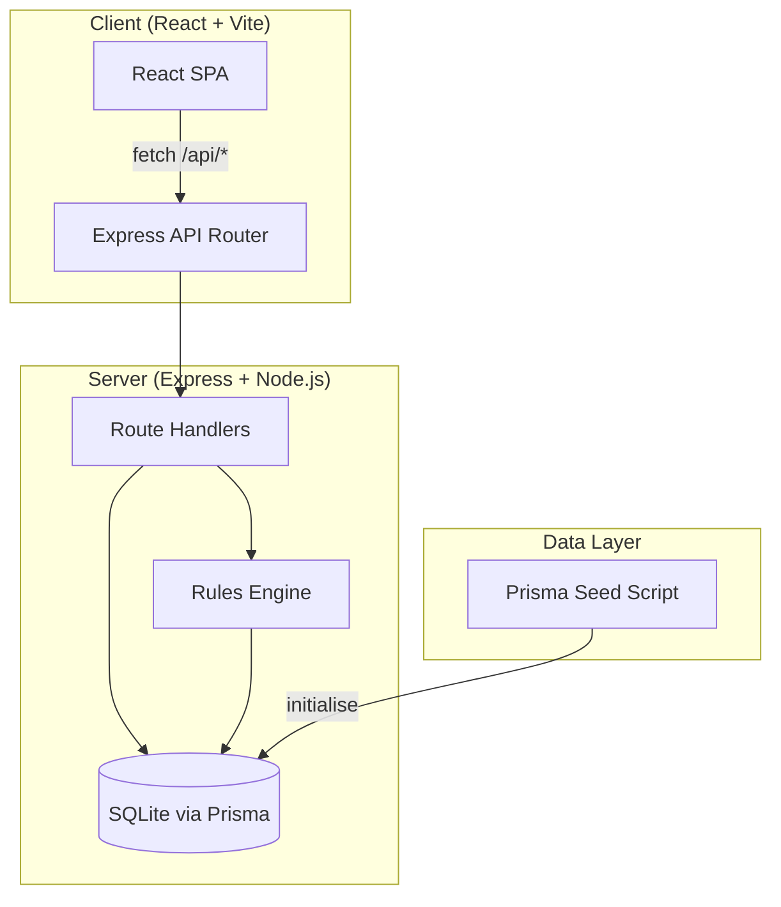
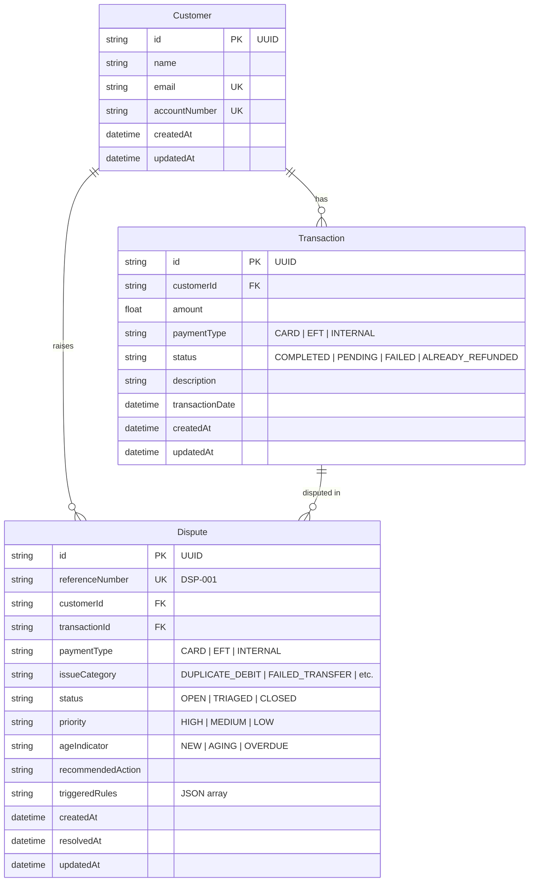
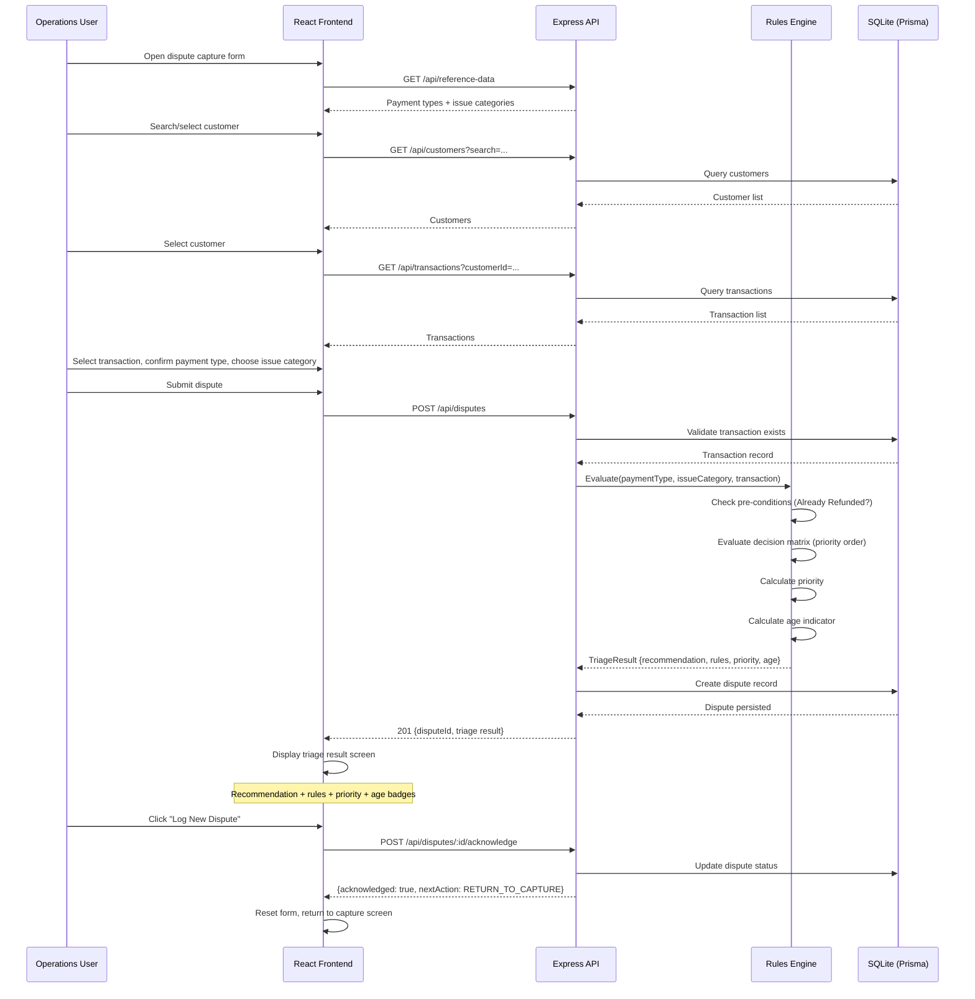
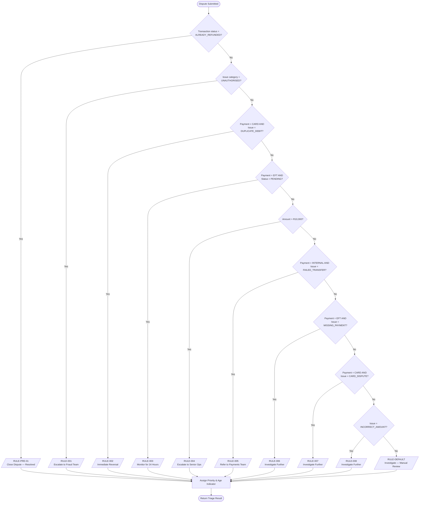
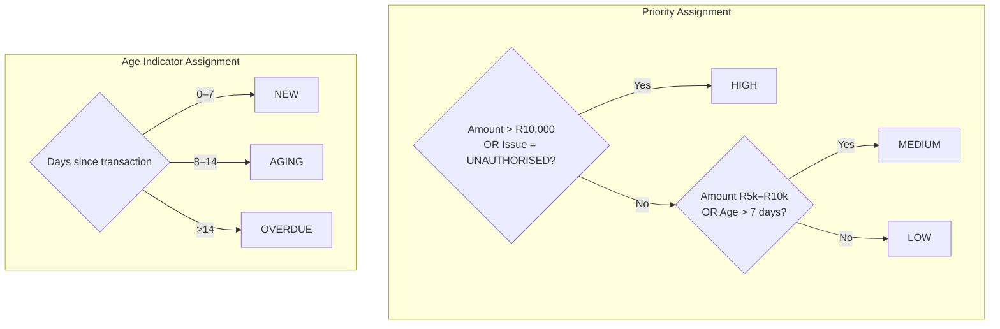
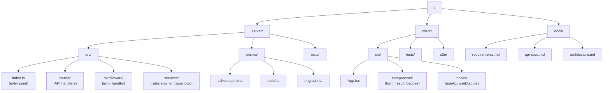
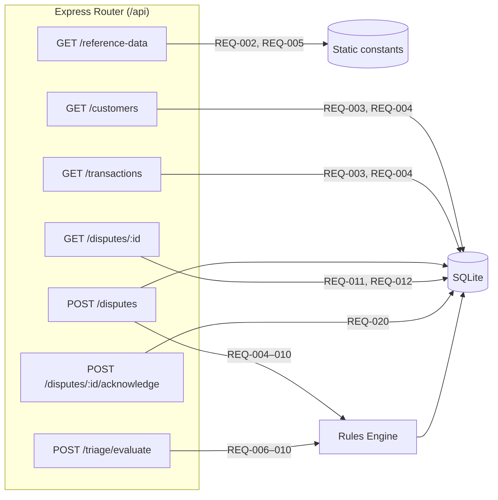
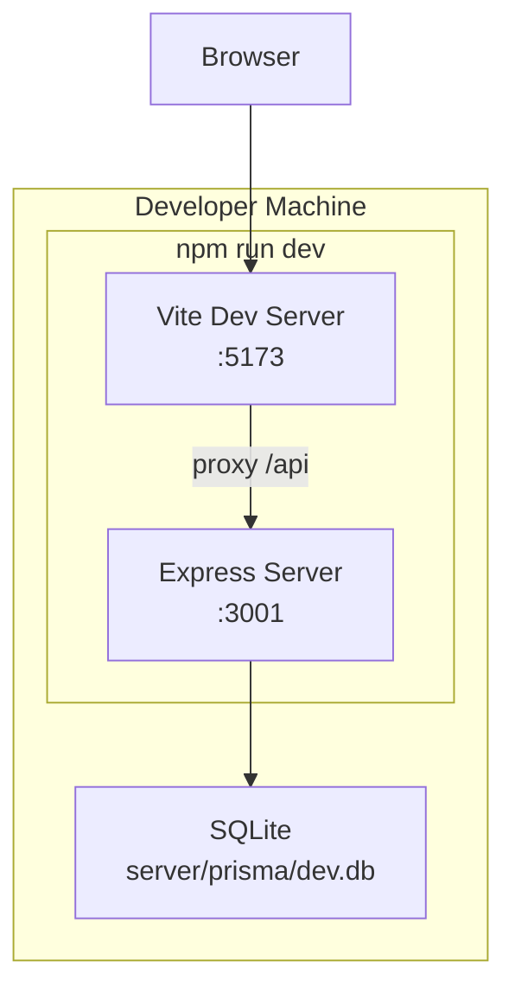

# Architecture — Payment Dispute Triage System

## 1. System Overview

A full-stack monorepo with a React SPA frontend communicating with an Express API backend. All data is persisted in a local SQLite database via Prisma ORM. No external integrations exist (REQ-001).



---

## 2. Component Architecture

```mermaid
graph LR
    subgraph Frontend
        App[App.tsx]
        App --> CaptureForm[DisputeCaptureForm]
        App --> ResultScreen[TriageResultScreen]
        CaptureForm -->|POST /api/disputes| API
        ResultScreen -->|GET /api/disputes/:id| API
        CaptureForm -->|GET /api/customers| API
        CaptureForm -->|GET /api/transactions| API
        CaptureForm -->|GET /api/reference-data| API
        ResultScreen -->|POST /api/disputes/:id/acknowledge| API
    end

    subgraph Backend
        API[API Router]
        API --> CustomersRoute[/api/customers]
        API --> TransactionsRoute[/api/transactions]
        API --> ReferenceRoute[/api/reference-data]
        API --> DisputesRoute[/api/disputes]
        API --> TriageRoute[/api/triage/evaluate]
        DisputesRoute --> RulesEngine[Rules Engine]
        TriageRoute --> RulesEngine
        RulesEngine --> PriorityCalc[Priority Calculator]
        RulesEngine --> AgeCalc[Age Calculator]
    end
```

---

## 3. Data Model (Entity Relationship)



---

## 4. User Flow (Sequence Diagram)



---

## 5. Rules Engine Flow



---

## 6. Priority & Age Assignment



---

## 7. Folder Structure



---

## 8. Technology Decisions

| Layer | Technology | Rationale |
|-------|-----------|-----------|
| Frontend framework | React 18 | Component-based, widely understood, supports rapid prototyping |
| Build tool | Vite 5 | Fast HMR, minimal config, proxies API requests to backend |
| Styling | Tailwind CSS 3 | Utility-first, rapid UI development, consistent design |
| Backend framework | Express 4 | Lightweight, flexible, well-documented |
| Language | TypeScript | Type safety across full stack, better IDE support |
| ORM | Prisma 5 | Type-safe database access, auto-generated client, easy migrations |
| Database | SQLite | Zero-config, file-based, perfect for local prototype (REQ-001) |
| Testing | Vitest + Playwright | Fast unit tests + reliable e2e browser tests |
| Runtime | Node.js >=20 | LTS stability, native ES module support |

---

## 9. API Route Mapping



---

## 10. Deployment Model (Local Prototype)



No cloud deployment, no containers, no external services. The entire system runs locally via `npm run dev`.
