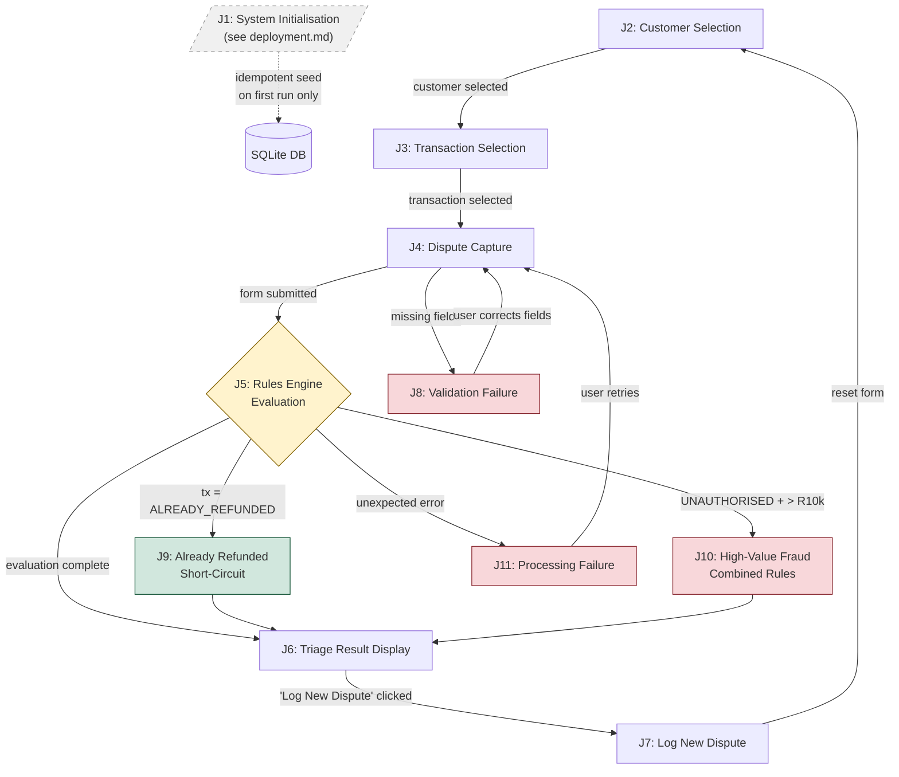

# User Journeys — Intelligent Triage of Customer Payment Disputes

This document defines the complete set of user journeys derived from the EARS requirements specification (`docs/requirements.md`). Each journey is traceable to one or more REQ identifiers and expressed using EARS notation patterns.

Use this document to inform: test case design, API endpoint specification, UI component specification, and system architecture decisions.

---

## Notation Reference

| Pattern | Template |
|---------|----------|
| Event-driven | **When** [trigger], the system shall [action] |
| State-driven | **While** [state], the system shall [behaviour] |
| Conditional (Where) | **Where** [condition], the system shall [action] |
| Unwanted behaviour (If/Then) | **If** [condition], **then** the system shall [action] |
| Ubiquitous | The system shall [action] |

---

## High-Level Journey Diagram



### Diagram Legend

| Shape/Colour | Meaning |
|--------------|---------|
| Dashed box (grey) | Deployment-time concern — not a runtime user journey |
| Diamond (amber) | Decision/processing node — rules engine |
| Red boxes | Unhappy/error paths (J8, J10, J11) |
| Green box | Short-circuit resolution (J9) |
| Solid arrows | Primary user flow |
| Dashed arrow | Infrastructure dependency |

---

## Journey 1: System Initialisation

> **Extracted to:** `docs/deployment.md`
>
> System initialisation (database connection, migration, idempotent seeding) is a deployment-time concern, not a user-facing journey. It occurs once on first deployment and is skipped on subsequent server restarts when data already exists.
>
> See [`deployment.md`](./deployment.md) for: seed precondition checks, data distribution requirements, idempotency guarantees, deployment sequence, and test implications.
>
> **Key invariant:** If customer or transaction records already exist in the database, seeding is skipped entirely.

**Requirements:** REQ-001, REQ-002, REQ-003

---

## Journey 2: Customer Selection

**Actor:** Operations User
**Trigger:** User navigates to dispute capture screen
**Requirements:** REQ-004

### Steps (EARS)

1. **When** the operations user opens the dispute capture screen, the system shall present a searchable list of mock customers. *(REQ-004)*
2. **When** the user searches by name or account number, the system shall filter the customer list to matching results. *(REQ-004)*
3. **When** the user selects a customer, the system shall store the selection and advance to transaction selection. *(REQ-004)*

### Postconditions

- A single customer is selected and their ID is retained for the next step.

### Test Implications

| Layer | What to verify |
|-------|---------------|
| API | `GET /api/customers` returns list; supports search/filter query params |
| UI | Customer list renders; search input filters results; selection highlights and advances flow |

---

## Journey 3: Transaction Selection

**Actor:** Operations User
**Trigger:** Customer is selected (Journey 2 complete)
**Requirements:** REQ-004

### Steps (EARS)

1. **When** a customer is selected, the system shall display all transactions belonging to that customer. *(REQ-004)*
2. The system shall display transaction details including amount, payment type, status, date, and description. *(REQ-004)*
3. **When** the user selects a transaction, the system shall store the selection and advance to dispute capture. *(REQ-004)*

### Postconditions

- A single transaction is selected; its `paymentType`, `status`, `amount`, and `transactionDate` are available for the dispute form and rules engine.

### Test Implications

| Layer | What to verify |
|-------|---------------|
| API | `GET /api/customers/:id/transactions` returns filtered list |
| UI | Transaction list renders with all fields; selection advances to dispute form |

---

## Journey 4: Dispute Capture (Happy Path)

**Actor:** Operations User
**Trigger:** Transaction is selected (Journey 3 complete)
**Requirements:** REQ-004, REQ-005, REQ-006

### Steps (EARS)

1. **When** the user initiates a new dispute, the system shall pre-populate the payment type from the selected transaction. *(REQ-005)*
2. **When** the user initiates a new dispute, the system shall require the user to select an issue category from the fixed list: `DUPLICATE_DEBIT`, `FAILED_TRANSFER`, `MISSING_PAYMENT`, `UNAUTHORISED`, `INCORRECT_AMOUNT`, `CARD_DISPUTE`. *(REQ-005)*
3. The system shall limit selectable payment types to exactly: Card Payments, EFTs, Internal Transfers. *(REQ-002)*
4. **When** the dispute form is submitted with all mandatory fields completed, the system shall create a dispute record with a unique reference number (e.g., `DSP-001`). *(REQ-004)*
5. **When** the dispute form is submitted, the system shall evaluate the case using the static rules-based decision matrix. *(REQ-006)*

### Postconditions

- Dispute record is persisted with status `TRIAGED`, a recommendation, priority, age indicator, and triggered rules.

### Test Implications

| Layer | What to verify |
|-------|---------------|
| API | `POST /api/disputes` accepts `customerId`, `transactionId`, `paymentType`, `issueCategory`; returns dispute with `referenceNumber`, `recommendedAction`, `triggeredRules`, `priority`, `ageIndicator` |
| UI | Payment type pre-populated; issue category dropdown with 6 options; form submits on button click |
| Database | Dispute record persisted with all fields populated |

---

## Journey 5: Rules Engine Evaluation

**Actor:** System (automated, triggered by dispute submission)
**Trigger:** Dispute form submitted (Journey 4, Step 5)
**Requirements:** REQ-006, REQ-007, REQ-008, REQ-009, REQ-010, REQ-013, REQ-014, REQ-015, REQ-016, REQ-018

### Pre-check Phase

1. **If** the selected transaction has status `ALREADY_REFUNDED`, **then** the system shall immediately recommend "Close Dispute — Resolved" (`CLOSE_RESOLVED`) without evaluating further rules. *(REQ-018)*

### Decision Matrix Phase (evaluated in priority order — first match wins)

2. **Where** the issue category is `UNAUTHORISED`, the system shall recommend "Escalate to Fraud Team" (`ESCALATE_FRAUD`). *(REQ-009, RULE-001)*
3. **Where** the payment type is `CARD` and the issue is `DUPLICATE_DEBIT`, the system shall recommend "Immediate Reversal" (`IMMEDIATE_REVERSAL`). *(REQ-007, RULE-002)*
4. **Where** the payment type is `EFT` and the transaction status is `PENDING`, the system shall recommend "Monitor for 24 Hours" (`MONITOR_24H`). *(REQ-008, RULE-003)*
5. **Where** the transaction amount exceeds R10,000, the system shall recommend "Escalate to Senior Ops" (`ESCALATE_SENIOR`). *(RULE-004)*
6. **Where** the payment type is `INTERNAL` and the issue is `FAILED_TRANSFER`, the system shall recommend "Refer to Payments Team" (`REFER_PAYMENTS`). *(RULE-005)*
7. **Where** the payment type is `EFT` and the issue is `MISSING_PAYMENT`, the system shall recommend "Investigate Further" (`INVESTIGATE`). *(RULE-006)*
8. **Where** the payment type is `CARD` and the issue is `CARD_DISPUTE`, the system shall recommend "Investigate Further" (`INVESTIGATE`). *(RULE-007)*
9. **Where** the issue is `INCORRECT_AMOUNT`, the system shall recommend "Investigate Further" (`INVESTIGATE`). *(RULE-008)*
10. The system shall generate "Investigate Further — Manual Review Required" (`INVESTIGATE`) if no other rule matches. *(REQ-010, RULE-DEFAULT)*

### Priority Assignment Phase (independent of recommendation)

11. **Where** the transaction amount exceeds R10,000 OR issue category is `UNAUTHORISED`, the system shall assign priority `HIGH`. *(REQ-013, REQ-015)*
12. **Where** the transaction amount is R5,000–R10,000 OR dispute age exceeds 7 days, the system shall assign priority `MEDIUM`. *(REQ-015)*
13. The system shall assign priority `LOW` for all other cases. *(REQ-015)*
14. **If** multiple priority conditions match, **then** the system shall assign the highest applicable priority. *(REQ-015)*

### Age Indicator Phase

15. **Where** the dispute age is 0–7 days, the system shall assign age indicator `NEW`. *(REQ-014, REQ-016)*
16. **Where** the dispute age is 8–14 days, the system shall assign age indicator `AGING`. *(REQ-014, REQ-016)*
17. **Where** the dispute age exceeds 14 days, the system shall assign age indicator `OVERDUE`. *(REQ-014, REQ-016)*

### Recording Phase

18. The system shall record which rules were evaluated and which triggered on the dispute record. *(REQ-006)*
19. The system shall persist exactly one recommendation on the dispute record. *(REQ-010)*

### Postconditions

- Dispute record updated with: `recommendedAction`, `triggeredRules[]`, `priority`, `ageIndicator`, `status = TRIAGED`.

### Test Implications

| Layer | What to verify |
|-------|---------------|
| API / Service | Each rule fires correctly in isolation; priority order is respected; fallback fires when no rule matches; pre-check short-circuits; priority and age are assigned independently |
| Architecture | Rules engine is a pure function (deterministic, no side effects); configurable threshold constant for R10,000 |

---

## Journey 6: Triage Result Display

**Actor:** Operations User
**Trigger:** Rules engine evaluation completes (Journey 5 postcondition)
**Requirements:** REQ-011, REQ-012, REQ-015, REQ-016, REQ-019, REQ-021

### Steps (EARS)

1. **While** the rules engine is processing, the system shall display a visual loading indicator and disable the submit button. *(REQ-019)*
2. **When** the rules engine completes its evaluation, the system shall display the recommended next action prominently in a colour-coded card/banner. *(REQ-011)*
3. **While** displaying the recommended action, the system shall display the specific triggered business rules as human-readable sentences with the matching input values. *(REQ-012)*
4. The system shall visually represent priority using colour-coded badges: High (red), Medium (amber), Low (green). *(REQ-015)*
5. The system shall visually represent age using indicators: New (grey), Aging (amber), Overdue (red). *(REQ-016)*
6. The system shall present all triage results on a single screen: recommendation, triggered rules, decision factors, priority badge, age badge, dispute summary, and transaction details. *(REQ-021)*
7. The system shall colour-code the recommendation: Red = Escalate actions, Amber = Monitor/Investigate actions, Green = Resolve/Close actions. *(REQ-011)*

### Colour Mapping

| Recommendation Code | Colour |
|---------------------|--------|
| `ESCALATE_FRAUD` | Red |
| `ESCALATE_SENIOR` | Red |
| `MONITOR_24H` | Amber |
| `INVESTIGATE` | Amber |
| `REFER_PAYMENTS` | Amber |
| `IMMEDIATE_REVERSAL` | Green |
| `CLOSE_RESOLVED` | Green |

### Postconditions

- User sees the full triage output without navigation to another screen.

### Test Implications

| Layer | What to verify |
|-------|---------------|
| UI | Loading spinner shown during API call; submit button disabled; result card renders with correct colour; rules list renders; priority and age badges render with correct colours; all content on single screen; no tabs/modals required |
| Accessibility | Colour is not the sole indicator — text labels accompany badges |

---

## Journey 7: Log New Dispute (Sequential Processing)

**Actor:** Operations User
**Trigger:** User views triage result (Journey 6 complete)
**Requirements:** REQ-020

### Steps (EARS)

1. **When** the user clicks "Log New Dispute" or "Back to Capture", the system shall reset the form and navigate to the capture screen. *(REQ-020)*
2. **When** the user returns to capture, the system shall clear all previous dispute data from the form. *(REQ-020)*
3. The system shall persist the previously triaged dispute (it remains in the database unchanged). *(REQ-020)*

### Postconditions

- Form is clean with no stale data; user can begin a new dispute.
- Previously triaged dispute remains queryable.

### Test Implications

| Layer | What to verify |
|-------|---------------|
| UI | Button is visible and labelled; click resets form state; no stale values in dropdowns or fields |
| Database | Previous dispute record unchanged after navigation |

---

## Journey 8: Validation Failure (Unhappy Path)

**Actor:** Operations User
**Trigger:** User submits dispute form with missing mandatory fields
**Requirements:** REQ-017

### Steps (EARS)

1. **If** the user attempts to submit without selecting a payment type, **then** the system shall display "Payment type is required" inline next to the field. *(REQ-017)*
2. **If** the user attempts to submit without selecting an issue category, **then** the system shall display "Issue category is required" inline next to the field. *(REQ-017)*
3. **If** mandatory fields are missing, **then** the system shall prevent form submission. *(REQ-017)*
4. The system shall keep the submit button enabled (validation fires on submit attempt for discoverability). *(REQ-017)*

### Postconditions

- No dispute record is created; no API call is made; user sees inline errors.

### Test Implications

| Layer | What to verify |
|-------|---------------|
| UI | Submit with empty payment type shows error; submit with empty issue category shows error; both errors can show simultaneously; submit button remains enabled; no network request fires |
| API | Server-side validation also rejects missing fields (defence in depth) |

---

## Journey 9: Already Refunded Short-Circuit

**Actor:** Operations User
**Trigger:** User submits a dispute against a transaction with status `ALREADY_REFUNDED`
**Requirements:** REQ-018

### Steps (EARS)

1. **If** the selected transaction has status `ALREADY_REFUNDED`, **then** the system shall immediately recommend "Close Dispute — Resolved" (`CLOSE_RESOLVED`). *(REQ-018)*
2. **If** the transaction is already refunded, **then** the system shall not evaluate any further rules in the decision matrix. *(REQ-018)*
3. The system shall record the triggered rule as: "Rule: Transaction Already Refunded → Close Dispute". *(REQ-018)*

### Postconditions

- Dispute is triaged with `CLOSE_RESOLVED`; no other rules fire; result displays with green colour coding.

### Test Implications

| Layer | What to verify |
|-------|---------------|
| API / Service | Pre-check fires before main matrix; only one rule in `triggeredRules`; recommendation is `CLOSE_RESOLVED` regardless of payment type or issue category |
| UI | Green result card; rule transparency shows only the refunded rule |

---

## Journey 10: High-Value Fraud Dispute (Combined Rules)

**Actor:** Operations User
**Trigger:** User submits a dispute for an unauthorised transaction above R10,000
**Requirements:** REQ-009, REQ-013, REQ-015

### Steps (EARS)

1. **Where** the issue category is `UNAUTHORISED`, the system shall recommend "Escalate to Fraud Team" (`ESCALATE_FRAUD`). *(REQ-009 — highest priority rule)*
2. **Where** the transaction amount exceeds R10,000, the system shall assign priority `HIGH`. *(REQ-013)*
3. **Where** the issue category is `UNAUTHORISED`, the system shall assign priority `HIGH`. *(REQ-015)*

### Key Behaviour

- The fraud rule (RULE-001, priority 1) fires before the high-value rule (RULE-004, priority 4).
- Priority assignment is `HIGH` from either condition — they are independent of the recommendation.
- Both contributing factors are visible in the decision factors display.

### Postconditions

- Recommendation: `ESCALATE_FRAUD`; Priority: `HIGH`; triggered rule records fraud escalation.

### Test Implications

| Layer | What to verify |
|-------|---------------|
| Service | Fraud rule takes precedence over amount rule; priority is HIGH; recommendation is ESCALATE_FRAUD not ESCALATE_SENIOR |

---

## Journey 11: Processing Failure (Error State)

**Actor:** Operations User
**Trigger:** Rules engine encounters an unexpected error
**Requirements:** REQ-019

### Steps (EARS)

1. **While** the rules engine is processing, the system shall display a loading indicator. *(REQ-019)*
2. **If** processing fails, **then** the system shall replace the loading indicator with an error message. *(REQ-019)*
3. **If** processing fails, **then** the system shall re-enable the submit button so the user can retry. *(REQ-019)*

### Postconditions

- User sees an error message; no dispute record is created in a partial state; user can retry.

### Test Implications

| Layer | What to verify |
|-------|---------------|
| API | 500-level response body contains meaningful error; no partial dispute persisted |
| UI | Error message replaces spinner; submit button re-enabled; retry works |

---

## Scenario Matrix for Test Coverage

This matrix maps every combination of payment type × issue category to the expected rule and recommendation. Use this for exhaustive test case generation.

| # | Payment Type | Issue Category | Tx Status | Amount | Expected Rule | Expected Action |
|---|---|---|---|---|---|---|
| 1 | CARD | DUPLICATE_DEBIT | COMPLETED | < R10k | RULE-002 | IMMEDIATE_REVERSAL |
| 2 | CARD | DUPLICATE_DEBIT | COMPLETED | > R10k | RULE-002 | IMMEDIATE_REVERSAL |
| 3 | CARD | UNAUTHORISED | any | any | RULE-001 | ESCALATE_FRAUD |
| 4 | CARD | CARD_DISPUTE | COMPLETED | < R10k | RULE-007 | INVESTIGATE |
| 5 | CARD | CARD_DISPUTE | COMPLETED | > R10k | RULE-004 | ESCALATE_SENIOR |
| 6 | CARD | INCORRECT_AMOUNT | COMPLETED | < R10k | RULE-008 | INVESTIGATE |
| 7 | CARD | INCORRECT_AMOUNT | COMPLETED | > R10k | RULE-004 | ESCALATE_SENIOR |
| 8 | CARD | FAILED_TRANSFER | COMPLETED | < R10k | RULE-DEFAULT | INVESTIGATE |
| 9 | CARD | MISSING_PAYMENT | COMPLETED | < R10k | RULE-DEFAULT | INVESTIGATE |
| 10 | EFT | DUPLICATE_DEBIT | PENDING | < R10k | RULE-003 | MONITOR_24H |
| 11 | EFT | DUPLICATE_DEBIT | COMPLETED | < R10k | RULE-DEFAULT | INVESTIGATE |
| 12 | EFT | MISSING_PAYMENT | COMPLETED | < R10k | RULE-006 | INVESTIGATE |
| 13 | EFT | MISSING_PAYMENT | PENDING | < R10k | RULE-003 | MONITOR_24H |
| 14 | EFT | FAILED_TRANSFER | PENDING | < R10k | RULE-003 | MONITOR_24H |
| 15 | EFT | FAILED_TRANSFER | COMPLETED | < R10k | RULE-DEFAULT | INVESTIGATE |
| 16 | EFT | UNAUTHORISED | any | any | RULE-001 | ESCALATE_FRAUD |
| 17 | EFT | any | any | > R10k | RULE-004* | ESCALATE_SENIOR* |
| 18 | INTERNAL | FAILED_TRANSFER | COMPLETED | < R10k | RULE-005 | REFER_PAYMENTS |
| 19 | INTERNAL | FAILED_TRANSFER | COMPLETED | > R10k | RULE-004 | ESCALATE_SENIOR |
| 20 | INTERNAL | UNAUTHORISED | any | any | RULE-001 | ESCALATE_FRAUD |
| 21 | INTERNAL | MISSING_PAYMENT | COMPLETED | < R10k | RULE-DEFAULT | INVESTIGATE |
| 22 | INTERNAL | DUPLICATE_DEBIT | COMPLETED | < R10k | RULE-DEFAULT | INVESTIGATE |
| 23 | any | any | ALREADY_REFUNDED | any | RULE-PRE-01 | CLOSE_RESOLVED |

*Note: Row 17 — RULE-001 (UNAUTHORISED) would take precedence if that is the issue category. The `*` indicates the high-value rule fires only when no higher-priority rule matches first.*

---

## Priority Assignment Matrix

| Amount | Issue Category | Age | Expected Priority |
|--------|---------------|-----|-------------------|
| > R10,000 | any | any | HIGH |
| any | UNAUTHORISED | any | HIGH |
| R5,000–R10,000 | not UNAUTHORISED | ≤ 7 days | MEDIUM |
| < R5,000 | not UNAUTHORISED | > 7 days | MEDIUM |
| R5,000–R10,000 | not UNAUTHORISED | > 7 days | MEDIUM (highest wins, both conditions met) |
| < R5,000 | not UNAUTHORISED | ≤ 7 days | LOW |

---

## Age Indicator Matrix

| Days Since Transaction | Indicator | Badge Colour |
|------------------------|-----------|--------------|
| 0–7 | NEW | Grey |
| 8–14 | AGING | Amber |
| 15+ | OVERDUE | Red |

---

## API Contracts (Implied by Journeys)

| Endpoint | Method | Journey | Purpose |
|----------|--------|---------|---------|
| `/api/customers` | GET | J2 | List/search customers |
| `/api/customers/:id/transactions` | GET | J3 | List transactions for a customer |
| `/api/disputes` | POST | J4 | Create and triage a dispute |
| `/api/health` | GET | J1 | Verify system is running |

### POST /api/disputes — Request Body

```json
{
  "customerId": "string",
  "transactionId": "string",
  "paymentType": "CARD | EFT | INTERNAL",
  "issueCategory": "DUPLICATE_DEBIT | FAILED_TRANSFER | MISSING_PAYMENT | UNAUTHORISED | INCORRECT_AMOUNT | CARD_DISPUTE"
}
```

### POST /api/disputes — Response Body

```json
{
  "id": "string",
  "referenceNumber": "DSP-001",
  "customerId": "string",
  "transactionId": "string",
  "paymentType": "CARD",
  "issueCategory": "DUPLICATE_DEBIT",
  "status": "TRIAGED",
  "priority": "HIGH | MEDIUM | LOW",
  "ageIndicator": "NEW | AGING | OVERDUE",
  "recommendedAction": "IMMEDIATE_REVERSAL",
  "triggeredRules": ["Rule: Card Payment + Duplicate Debit → Immediate Reversal"],
  "transaction": { "amount": 1250, "status": "COMPLETED", "transactionDate": "..." },
  "createdAt": "ISO-8601"
}
```

---

## UI Screens (Implied by Journeys)

| Screen | Journeys | Key Components |
|--------|----------|----------------|
| Customer Selection | J2 | Search input, customer list, select action |
| Transaction Selection | J3 | Transaction table with amount/type/status/date columns, select action |
| Dispute Capture Form | J4, J8 | Payment type dropdown (pre-populated), issue category dropdown, submit button, inline validation errors |
| Triage Result | J6, J7, J9, J10 | Recommendation banner (colour-coded), rules list, decision factors, priority badge, age badge, dispute summary, transaction details, "Log New Dispute" button |
| Loading State | J6, J11 | Spinner overlay, disabled submit button |

---

## Architecture Constraints (Derived from Journeys)

| Constraint | Source | Implication |
|------------|--------|-------------|
| No external network calls | REQ-001, [`deployment.md`](./deployment.md) | No HTTP client libraries calling external APIs; SQLite only |
| Idempotent seeding | REQ-003, [`deployment.md`](./deployment.md) | Seed script checks for existing data before inserting; safe to run repeatedly |
| Deterministic rules engine | REQ-006, J5 | Pure function: same inputs → same output; no randomness or time-dependent branching (except age calculation) |
| Configurable threshold | REQ-013, J5 | R10,000 threshold defined in single constants file or environment variable |
| Single-screen result | REQ-021, J6 | No routing to sub-pages for result display; all data returned in one API response |
| Sequential reference numbers | REQ-004, J4 | `DSP-XXX` format; auto-incrementing or count-based |
| Offline-capable | REQ-001, [`deployment.md`](./deployment.md) | No runtime dependency on network after `npm install` |
